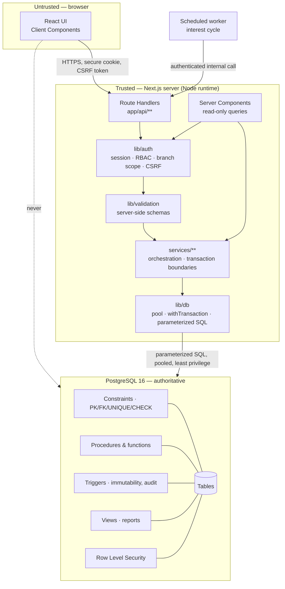
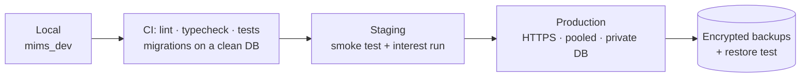

# 03 — Architecture

**One sentence:** a Next.js application whose server layer is the only thing that talks to
PostgreSQL, using handwritten parameterized SQL, with financial invariants enforced by the
database itself.

---

## Trust boundaries



The dotted line is the rule that matters most: **the browser never reaches the database.**
There is no client-side database SDK, no `NEXT_PUBLIC_` connection string, and `pg` is
listed in `serverExternalPackages` so it cannot be bundled into a client build.

## Layers and their responsibilities

| Layer | Responsibility | Must not |
|---|---|---|
| **Client Components** | Input, formatting, optimistic feedback | Contain a business rule that is not also enforced server-side |
| **Server Components** | Render authorized read-only data | Perform writes; call the pool directly |
| **Route Handlers** (`app/api/**`) | Parse → authenticate → authorize → validate → call service → map result | Contain SQL; contain business logic |
| **`lib/auth`** | Sessions, password hashing, `requireRole()`, `branchScope()`, CSRF | Trust anything from the request body about identity |
| **`lib/validation`** | Server-side input schemas | Be skipped because "the form already checked" |
| **`services/**`** | Business orchestration; **owns transaction boundaries** | Import from `app/`; issue bare `BEGIN`/`COMMIT` |
| **`lib/db`** | Pool, `query`, `queryOne`, `withTransaction`, `allowListed` | Contain business logic |
| **PostgreSQL** | The authoritative record and the final enforcement of invariants | Hold all orchestration in triggers |

**`lib/db` is the only module permitted to import `pg`.** This single rule is what keeps
the architecture honest and is checked in review.

## Request path — a withdrawal

```mermaid
sequenceDiagram
    participant U as Agent (browser)
    participant R as POST /api/transactions/withdrawals
    participant A as lib/auth
    participant S as transaction-service
    participant D as PostgreSQL

    U->>R: amount, accountId, Idempotency-Key, CSRF token
    R->>A: requireRole('AGENT','BRANCH_MANAGER') + branchScope()
    A-->>R: user + scope (or 401/403)
    R->>R: validate input (server-side schema)
    R->>S: postWithdrawal({...})
    S->>D: BEGIN
    S->>D: SELECT ... FROM account WHERE account_id=$1 FOR UPDATE
    Note over S,D: lock BEFORE deciding; re-read status and balance
    S->>D: CALL sp_post_withdrawal($1,$2,...)
    Note over D: hours · mandate · limits · minimum balance<br/>insert ledger · update balance · audit
    alt all rules pass
        D-->>S: reference_number, new balance
        S->>D: COMMIT
        R-->>U: 201 + receipt
    else rule violated
        D-->>S: raise (P0001 / 23514 / 23505)
        S->>D: ROLLBACK
        R-->>U: 409 with a safe message
    end
```

Two details carry most of the correctness:

1. **Lock, then decide.** Validation performed before `FOR UPDATE` is stale by the time
   the write happens. `sp_post_withdrawal` re-reads status and balance after the lock.
2. **The error never leaks.** SQLSTATE codes are mapped to typed domain errors in
   `lib/db/errors.ts`; the client sees `{ error: { code, message } }` with no SQL text
   (NFR-SEC-05).

## Transaction boundaries

| Operation | Boundary | Isolation | Why |
|---|---|---|---|
| Open savings account | account + holders + mandate + optional initial deposit + audit | READ COMMITTED | Atomic per FR-ACC; a partial account with no holder is invalid |
| Post deposit | lock → ledger → balance → audit | READ COMMITTED + `FOR UPDATE` | FR-DEP-03/05 |
| Post withdrawal | lock → re-validate → ledger → balance → audit | READ COMMITTED + `FOR UPDATE` | The lock is what makes AC-06 hold |
| Reverse transaction | compensating entry + reversal link + balance + audit | READ COMMITTED + `FOR UPDATE` | Original is never modified (BR-16) |
| Open fixed deposit | eligibility (locked) → debit principal → create FD + audit | READ COMMITTED + `FOR UPDATE` | No partially funded FD (§4.9) |
| **Interest cycle** | **one transaction per FD distribution**, not per run | READ COMMITTED + `FOR UPDATE` | FR-INT-04: one failure must not roll back completed distributions |

Never hold a transaction open across a network call or user interaction.

## Concurrency model

- **Lost updates** are prevented by row-level locking, not by optimistic retry
  (NFR-REL-02).
- **Deadlocks** are avoided by always acquiring account locks in a deterministic order
  (ascending `account_id`) when more than one account is involved.
- `40001` / `40P01` are retried once by `lib/db` before surfacing.
- Idempotency is a **database constraint** (partial unique index), not application memory,
  so it survives a restart (NFR-REL-03).

## Authentication and authorization

- Sign-in verifies an argon2id hash, creates a `user_session` row, and sets a
  `Secure` / `HttpOnly` / `SameSite=Lax` cookie carrying only an opaque token.
- Only the token **hash** is stored, so a database read cannot impersonate a user.
- Every request resolves the session server-side; expiry and revocation are checked in the
  database, which makes server-side invalidation real (FR-AUTH-04).
- `requireRole()` gates the role; `branchScope()` returns a scope object that services
  apply **inside the SQL `WHERE` clause**, never as a post-fetch filter.
- Row Level Security on `customer`, `account` and `transaction` is the backstop: even a
  service-layer bug cannot leak another branch's rows (NFR-SEC-07).

Two database roles: `mims_owner` (migrations only) and `mims_app` (runtime — no `DROP`, no
`UPDATE`/`DELETE` on `transaction` or `audit_log`).

## Folder architecture

```
app/
  (auth)/sign-in/            M1
  admin/                     M1 — users, roles, parameters, audit, health
  branches/  agents/  customers/    M2
  plans/  accounts/          M3
  transactions/              M4
  fd-products/  fixed-deposits/  interest-runs/   M5
  reports/                   M1 shell; each report page by its owner
  api/                       route handlers, mirroring the above
components/
  app-shell/                 M1 — shared, M1 approves changes
  report/                    M1 — shared
  ui/                        primitives; see ui-registry.md
lib/  db/ auth/ validation/
services/                    one module per domain area
database/  migrations/ routines/ triggers/ views/ indexes/ roles/ seed/ tests/
tests/  db/ api/ e2e/
```

## Deployment



Separate databases and secrets per environment; the production database is not publicly
reachable; migrations are reviewed and tested in staging before production; a failed
migration stops the deploy and follows the documented rollback (SRS §9.1). Details in
`14_git-workflow.md` and `10_local-setup.md`.

## Decisions that shaped this

| Decision | Chosen | Rejected | Why |
|---|---|---|---|
| Data access | `pg` + handwritten SQL | Any ORM | Prohibited; and the SQL *is* the deliverable (AC-02) |
| Business logic location | Services + stored routines | All in triggers | Triggers hide control flow; SRS §6.5 wants visible transaction boundaries |
| Balance storage | Controlled column + ledger | Recompute from ledger every read | Locking a single row serialises withdrawals cleanly; reconciled in Phase 5 (D-1) |
| Idempotency | Partial unique index | In-memory cache | Survives restart; is a real ACID guarantee |
| Branch scope | In the SQL `WHERE` + RLS | Filter after fetching | Fetching then filtering means the rows already left the database |
| Interest cycle | One transaction per FD | One per run | FR-INT-04 |

Full records in `.agent/decisions/`.
