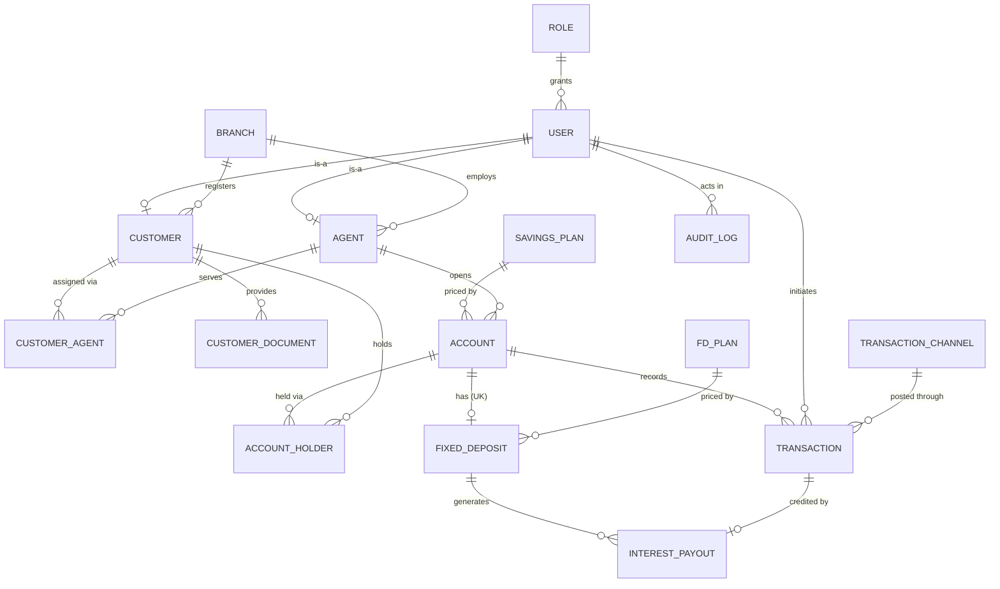

# 04 — Database Schema

**Baseline:** `group_32_ERD2` (16 tables). **Status:** Phase 0 — documented, not yet built.

This document has two clearly separated parts:

- **Part A — CURRENT ERD.** What our approved ERD actually says. Nothing invented.
- **Part B — PROPOSED CHANGES.** Every deviation, each traceable to a finding in
  `17_erd-gap-analysis.md`. **Nothing in Part B may be implemented until it is approved.**

> Rule: if you need a schema change that is not in Part A or an approved Part B item,
> stop. Add it to `17_erd-gap-analysis.md` and `.agent/open-questions.md` first. Do not
> invent schema in a migration.

**Conventions** (AGENTS.md §8): `snake_case`, singular table names, `uuid` surrogate PKs
via `gen_random_uuid()`, `TIMESTAMPTZ` for all instants, `money_amount`/`positive_money`/
`interest_rate` domains from migration `0000`, FKs to financial history are
`ON DELETE RESTRICT`.

---

# Part A — CURRENT ERD (16 tables)

## Entity map

## Reference and identity tables

### `role`
Application roles (SRS §2.4 defines seven user classes).

| Column | Type | Notes |
|---|---|---|
| `role_id` | uuid | **PK** |
| `role_name` | varchar(50) | **UK** |
| `description` | varchar(255) | |
| `status` | varchar(20) | `record_status` |

- Delete: `RESTRICT` — referenced by `user`.
- Index: PK plus the `role_name` unique index.
- Invariant: seeded rows cover every demonstrated role (SRS B.2).

### `user`
Authentication identity. **`user` is a reserved word in SQL** — the physical table will be
created as **`app_user`** (matching SRS §6.2, which already calls it `app_user`). The ERD
name is retained in diagrams.

| Column | Type | Notes |
|---|---|---|
| `user_id` | uuid | **PK** |
| `role_id` | uuid | **FK → role** |
| `username` | varchar(100) | **UK** |
| `password_hash` | varchar(255) | argon2id. Never logged, never returned by an API |
| `status` | varchar(20) | `record_status` |
| `registered_date` | date | |
| `last_login` | timestamptz | |

- Delete: `RESTRICT` — referenced by `transaction`, `audit_log`, `agent`, `customer`.
- Indexes: `username` unique; `(role_id, status)` for admin listing.
- Invariants: password is never plaintext (NFR-SEC); deactivate, never delete (FR-ORG-05).

### `branch`

| Column | Type | Notes |
|---|---|---|
| `branch_id` | uuid | **PK**, defaults to `gen_random_uuid()` |
| `branch_code` | varchar(20) | **UK, NOT NULL** |
| `branch_name` | varchar(100) | **NOT NULL** |
| `address` | varchar(255) | **NOT NULL** |
| `district` | varchar(100) | **NOT NULL** |
| `phone` | varchar(20) | **NOT NULL** |
| `status` | `record_status` | **NOT NULL**, defaults to `ACTIVE` |
| `created_at` | timestamptz | **NOT NULL**, defaults to `now()` |
| `updated_at` | timestamptz | **NOT NULL**, maintained by `trg_branch_set_updated_at` |

- Implemented by `0120_p01_m02_branch.sql`.
- Delete: references use `ON DELETE RESTRICT`; the first such FK is added by the agent
  schema in P01-M02-T02. Deactivate referenced branches instead (FR-ORG-05).

### `agent`
Subtype of `app_user` — `agent_id` is both PK and FK, so every agent has a login.

| Column | Type | Notes |
|---|---|---|
| `agent_id` | uuid | **PK, FK → app_user(user_id), ON DELETE RESTRICT** |
| `branch_id` | uuid | **NOT NULL, FK → branch, ON DELETE RESTRICT** |
| `employee_no` | varchar(30) | **UK, NOT NULL** |
| `nic_passport_no` | varchar(50) | **UK, NOT NULL** |
| `full_name` | varchar(150) | **NOT NULL** |
| `date_of_birth` | date | **NOT NULL** |
| `gender` | varchar(20) | **NOT NULL** |
| `phone` | varchar(20) | **NOT NULL** |
| `address` | varchar(255) | **NOT NULL** |
| `email` | varchar(150) | **UK, NOT NULL** |
| `hired_date` | date | **NOT NULL** |
| `status` | `record_status` | **NOT NULL**, defaults to `ACTIVE` |
| `created_at` | timestamptz | **NOT NULL**, defaults to `now()` |
| `updated_at` | timestamptz | **NOT NULL**, maintained by `trg_agent_set_updated_at` |

- Implemented by `0121_p01_m02_agent.sql`.
- Delete: `RESTRICT`; future references from `account.opened_by_agent_id` and
  `customer_agent` also use `RESTRICT`.
- Index: `ix_agent_branch_status (branch_id, status)` for branch-scoped active-agent lists.
- Invariant: an active agent must reference an active branch. The agent trigger locks and
  validates the branch; the branch trigger rejects deactivation while active agents exist.

### `customer`
Subtype of `user` in the current ERD. See **G-20** — this is contested.

| Column | Type | Notes |
|---|---|---|
| `customer_id` | uuid | **PK, FK → user(user_id)** |
| `branch_id` | uuid | **FK → branch** — home branch (FR-CUS-02) |
| `nic_passport_no` | varchar(50) | **UK** |
| `full_name` | varchar(150) | |
| `date_of_birth` | date | Drives plan eligibility (FR-ACC-02) |
| `gender` | varchar(20) | |
| `phone` | varchar(20) | |
| `address` | varchar(255) | |
| `email` | varchar(150) | **UK** |

- Delete: `RESTRICT`.
- Indexes: `nic_passport_no` unique (duplicate detection, SRS §6.7); `(branch_id)`;
  trigram index on `full_name` for search.
- Invariants: `date_of_birth` in the past; identity masked from unauthorised roles
  (FR-CUS-04); ≥ 15 customers seeded (FR-CUS-05).

### `customer_agent`
Effective-dated customer-to-agent assignment; preserves history (FR-CUS-03).

| Column | Type | Notes |
|---|---|---|
| `cust_agent_id` | uuid | **PK** |
| `customer_id` | uuid | **FK → customer** |
| `agent_id` | uuid | **FK → agent** |
| `assigned_date` | date | |
| `end_date` | date | NULL while current |
| `is_active` | boolean | ERD says `tinyint`; PostgreSQL uses `boolean` |

- Invariant: exactly one active row per customer (FR-CUS-02) — **unenforced in the ERD, see
  G-10**.
- Check: `end_date IS NULL OR end_date >= assigned_date`.

### `customer_document`

| Column | Type | Notes |
|---|---|---|
| `doc_id` | uuid | **PK** |
| `customer_id` | uuid | **FK → customer** |
| `doc_type` | varchar(50) | |
| `file_path` | varchar(500) | Path only — no file contents in the database |
| `uploaded_date` | timestamptz | |
| `verified_by` | uuid | **FK → user**, NULL until verified |
| `verified_date` | timestamptz | |

- Check: `(verified_by IS NULL) = (verified_date IS NULL)` — both set, or neither.
- ERD Assumption 3: documentation is required to open an account — enforced in
  `sp_open_savings_account`, not by a constraint.

## Product tables

### `savings_plan`

| Column | Type | Notes |
|---|---|---|
| `plan_id` | uuid | **PK** |
| `plan_name` | varchar(100) | **UK** — Children / Teen / Adult / Senior / Joint |
| `interest_rate` | `interest_rate` | 0.1200 / 0.1100 / 0.1000 / 0.1300 / 0.0700 |
| `min_balance` | `money_amount` | 0 / 500 / 1000 / 1000 / 5000 |
| `description` | varchar(255) | |
| `status` | varchar(20) | `record_status` |

- Delete: `RESTRICT` — referenced by `account`.
- Invariant: rates and minimums exactly match BR-03…BR-07.
- Gap: no age bounds or holder counts — see **G-13**.

### `fd_plan`

| Column | Type | Notes |
|---|---|---|
| `fd_plan_id` | uuid | **PK** |
| `plan_name` | varchar(100) | **UK** |
| `tenure_months` | int | 6 / 12 / 36 |
| `interest_rate` | `interest_rate` | 0.1300 / 0.1400 / 0.1500 |
| `description` | varchar(255) | |
| `status` | varchar(20) | `record_status` |

- Check: `tenure_months > 0`.
- Invariant: exactly the three products in BR-13.

### `transaction_channel`

| Column | Type | Notes |
|---|---|---|
| `channel_id` | uuid | **PK** |
| `channel_name` | varchar(100) | **UK** — e.g. `BRANCH_COUNTER`, `ONLINE`, `SYSTEM` |
| `status` | varchar(20) | `record_status` |

- `SYSTEM` is the channel used by the central interest run.

## Account tables

### `account`

| Column | Type | Notes |
|---|---|---|
| `account_id` | uuid | **PK** |
| `plan_id` | uuid | **FK → savings_plan** |
| `opened_by_agent_id` | uuid | **FK → agent** |
| `account_number` | varchar(50) | **UK** (SRS §6.7) |
| `opened_date` | date | |
| `status` | varchar(20) | `ACTIVE` / `FROZEN` / `CLOSED` |
| `current_balance` | `money_amount` | Controlled balance — see G-18 |

- Delete: `RESTRICT` — referenced by `transaction`, `account_holder`, `fixed_deposit`.
- Indexes: `account_number` unique; `(plan_id)`; `(status)`.
- Invariants: balance never negative (NFR-SAFE-01); balance ≥ plan minimum after a
  withdrawal (NFR-SAFE-02); closing requires zero balance and no active FD (FR-ACC-05,
  BR-18).
- Gaps: no `branch_id` (**G-06**); no non-negative `CHECK` (**G-18**).

### `account_holder`
Intersection resolving the many-to-many between customers and accounts. This is what makes
joint accounts possible (SRS §6.3).

| Column | Type | Notes |
|---|---|---|
| `account_holder_id` | uuid | **PK** |
| `account_id` | uuid | **FK → account** |
| `customer_id` | uuid | **FK → customer** |
| `joined_date` | date | |
| — | | **UK (account_id, customer_id)** |

- The composite unique key prevents the same customer being added twice to one account.
- Invariants: an individual account has exactly one holder; a joint account has 2–4 adult
  holders (§4.4) — **unenforced in the ERD, see G-08**.

### `fixed_deposit`

| Column | Type | Notes |
|---|---|---|
| `fd_id` | uuid | **PK** |
| `account_id` | uuid | **FK → account, UK** ← see **G-01** |
| `fd_plan_id` | uuid | **FK → fd_plan** |
| `principal_amount` | `positive_money` | |
| `start_date` | date | |
| `next_interest_date` | date | Advanced by 30 days on each payout |
| `status` | varchar(20) | `ACTIVE` / `MATURED` / `CLOSED` |

- Indexes: `(status, next_interest_date)` — selects FDs due for interest (SRS §6.7).
- Invariants: the linked account is `ACTIVE` at opening (FR-FD-01); one *active* FD per
  account (BR-12 — **the ERD's plain `UNIQUE` says one FD ever; G-01**); ≥ 10 FDs seeded
  (FR-FD-05).
- Gaps: no `maturity_date` (**G-23**, folded into Part B); no rate snapshot (**G-11**).

## Financial tables

### `transaction`
The ledger. Immutable once posted (FR-TXN-02, BR-16).

| Column | Type | Notes |
|---|---|---|
| `transaction_id` | uuid | **PK** |
| `account_id` | uuid | **FK → account** |
| `initiated_by_user_id` | uuid | **FK → user** |
| `channel_id` | uuid | **FK → transaction_channel** |
| `reference_number` | varchar(50) | Unique per BR-10 — **not marked UK in the ERD; G-05** |
| `transaction_type` | varchar(50) | `DEPOSIT` / `WITHDRAWAL` / `INTEREST_CREDIT` / `REVERSAL` (FR-TXN-01) |
| `amount` | `positive_money` | Always positive; direction comes from the type |
| `transaction_date` | timestamptz | Business timestamp |
| `narration` | varchar(255) | |
| `created_at` | timestamptz | System insert time |

- Delete: **never**. `RESTRICT` everywhere, and a trigger rejects `UPDATE`/`DELETE`.
- Indexes: `(account_id, transaction_date DESC)` for statements; `reference_number`
  unique (SRS §6.7).
- Invariants: `amount > 0`; no row may be updated or deleted by an application role;
  every row has a reference, timestamp and type (BR-10).
- Gaps: no agent/branch (**G-07**); no idempotency key (**G-04**); no `balance_after`
  (**G-14**); no reversal link (**G-02**); no `status` (**G-02**).

### `interest_payout`

| Column | Type | Notes |
|---|---|---|
| `interest_id` | uuid | **PK** |
| `fd_id` | uuid | **FK → fixed_deposit**, NOT NULL ← see **G-12** |
| `transaction_id` | uuid | **FK → transaction, UK** |
| `payout_date` | date | |
| `interest_amount` | numeric(15,2) | |

- The `UNIQUE` on `transaction_id` implements SRS §6.3: each distribution links to exactly
  one `INTEREST_CREDIT` ledger entry.
- Gaps: no run linkage or cycle key (**G-03**); cannot represent savings interest
  (**G-12**).

### `audit_log`

| Column | Type | Notes |
|---|---|---|
| `log_id` | uuid | **PK** |
| `user_id` | uuid | **FK → user** — NULL needed for system actions (**G-22**, Part B) |
| `entity_type` | varchar(100) | |
| `entity_id` | uuid | |
| `action` | varchar(50) | |
| `old_values` | jsonb | ERD says `json`; use `jsonb` for indexing |
| `new_values` | jsonb | |
| `ip_address` | varchar(45) | IPv6-capable length |
| `logged_at` | timestamptz | |

- Append-only. No `UPDATE`, no `DELETE`, for any application role.
- Indexes: `(user_id, logged_at DESC)` and `(entity_type, entity_id)` (SRS §6.7).
- Invariant: sensitive values are masked before being written (NFR-SEC-05).

---

# Part B — PROPOSED CHANGES (require approval)

Every item traces to `17_erd-gap-analysis.md`. **Do not implement anything here until the
corresponding open question is resolved and an ADR exists.**

## B.1 New tables (7)

| Table | Purpose | Gap | Owner |
|---|---|---|---|
| `transaction_reversal` | Links an original transaction to its compensating entry; `UNIQUE(original_transaction_id)` enforces "reversible once" (DB-CON-04) | G-02 | M4 |
| `interest_run` | One row per 30-day cycle. `UNIQUE(cycle_date)` prevents duplicate runs; stores counts, totals, exceptions (FR-INT-05) | G-03 | M5 |
| `joint_mandate` | `ANY_ONE` / `ALL_HOLDERS` operating rule per joint account (FR-ACC-04, BR-17) | G-08 | M3 |
| `system_parameter` | Business hours, withdrawal limits as data, not code (BR-08, §7.1) | G-15 | M1 |
| `business_calendar` | Working days and open/close times | G-15 | M1 |
| `user_session` | Server-side session records so sessions can be invalidated (FR-AUTH-04) | G-16 | M1 |
| `login_attempt` | Failed sign-in throttling (FR-AUTH-03) | G-17 | M1 |

**16 current + 7 proposed = 23 tables.**

## B.2 Column additions

| Table | Column | Reason | Gap |
|---|---|---|---|
| `account` | `branch_id uuid NOT NULL FK` | Owning branch fixed at opening; RLS anchor (FR-ACC-01) | G-06 |
| `transaction` | `agent_id uuid NULL FK` | RPT-01 is agent-wise (FR-DEP-02) | G-07 |
| `transaction` | `branch_id uuid NULL FK` | Branch attribution at posting time | G-07 |
| `transaction` | `idempotency_key varchar(80) NULL` | FR-DEP-04, AC-06 | G-04 |
| `transaction` | `balance_after money_amount NOT NULL` | FR-TXN-04 running-balance evidence | G-14 |
| `transaction` | `status varchar(20)` | `POSTED` / `REVERSED` | G-02 |
| `fixed_deposit` | `maturity_date date NOT NULL` | FR-FD-04, RPT-03 | G-23 |
| `fixed_deposit` | `interest_rate_at_opening interest_rate NOT NULL` | Rate fixed at opening; protects historical payouts (BR-19) | G-11 |
| `interest_payout` | `interest_run_id uuid FK`, `cycle_date date` | Cycle idempotency | G-03 |
| `savings_plan` | `min_age_years`, `max_age_years`, `min_holders`, `max_holders`, `requires_all_adult` | Data-driven eligibility (FR-ACC-02) | G-13 |
| `savings_plan`, `fd_plan` (implemented) | `effective_from`, `effective_to` | Effective-dated products (BR-19) | G-11 |
| `branch` | `branch_code varchar(20) UNIQUE` | §4.2 requires unique branch codes | — |
| `agent` | `employee_no varchar(30) UNIQUE`, `hired_date`, `status` | §4.2 unique employee numbers, FR-ORG-03 | — |
| `account_holder` | `holder_type varchar(20)` | `PRIMARY` / `JOINT` | G-08 |
| `audit_log` | `user_id` made NULL-able, `actor_type varchar(20)` | System-posted interest runs have no user | G-22 |

## B.3 Constraint changes

| Change | Reason | Gap | Approval |
|---|---|---|---|
| `fixed_deposit`: replace `UNIQUE(account_id)` with partial unique index `WHERE status='ACTIVE'` | One *active* FD, not one ever | G-01 | **Blocking** |
| `transaction.reference_number` → `UNIQUE NOT NULL` | BR-10, FR-DEP-02 | G-05 | **Blocking** |
| `account.current_balance` → `NOT NULL DEFAULT 0 CHECK (>= 0)` | NFR-SAFE-01 | G-18 | No |
| Partial unique index on `customer_agent(customer_id) WHERE is_active` | FR-CUS-02 | G-10 | No |
| `interest_payout`: `UNIQUE(fd_id, cycle_date)` | FR-INT-03, NFR-SAFE-03 | G-03 | Yes |
| Apply `money_amount` / `positive_money` / `interest_rate` domains throughout | SRS §6.1 | G-19 | No |

## B.4 Identity change (blocking)

`customer.customer_id` becomes an independent surrogate PK with an optional
`user_id uuid NULL UNIQUE FK → app_user`, instead of `PK,FK`. Depends on TBD-02 / **OQ-05**
(is customer self-service login required?). `agent` keeps the subtype pattern.

## B.5 Denormalisation register

SRS §6.1 requires intentional denormalisation to be documented. Three entries:

| # | Denormalised value | Derivable from | Why it is kept | Control |
|---|---|---|---|---|
| D-1 | `account.current_balance` | `SUM` of signed ledger amounts | Recomputing on every withdrawal does not scale and makes `FOR UPDATE` locking awkward; a single locked row serialises concurrent withdrawals cleanly | `CHECK (>= 0)`; only posting routines may write it; Phase 5 reconciliation view asserts equality with the ledger |
| D-2 | `transaction.balance_after` | Window function over prior rows | FR-TXN-04 balance evidence; O(1) statement rendering; survives reversal ordering ambiguity | Written inside the same locked transaction; reconciliation view compares against the window-function result |
| D-3 | `fixed_deposit.interest_rate_at_opening` | `fd_plan.interest_rate` | Rates are effective-dated (BR-19); reading through the plan would retroactively change historical payouts | `NOT NULL`; set once at opening; never updated |

All three remain **3NF-compliant by design intent**: the ledger stays authoritative and
each denormalised value is reconciled against its source in Phase 5.

## B.6 Normalisation position

| Form | How the design satisfies it |
|---|---|
| **1NF** | All attributes atomic. Repeating holders, documents, transactions and payouts live in child tables — no arrays, no comma-separated fields. |
| **2NF** | `account_holder` and `customer_agent` are intersection tables with surrogate PKs plus a composite `UNIQUE`; their non-key attributes (`joined_date`, `assigned_date`) depend on the whole key. |
| **3NF** | Plan rates, minimum balances, branch details and FD product terms are stored once and referenced by FK. No transitive dependency — e.g. `account` stores `plan_id`, never a copy of `interest_rate`. |
| **Documented exceptions** | D-1, D-2, D-3 above. Each is a controlled, reconciled denormalisation, not an oversight. |
