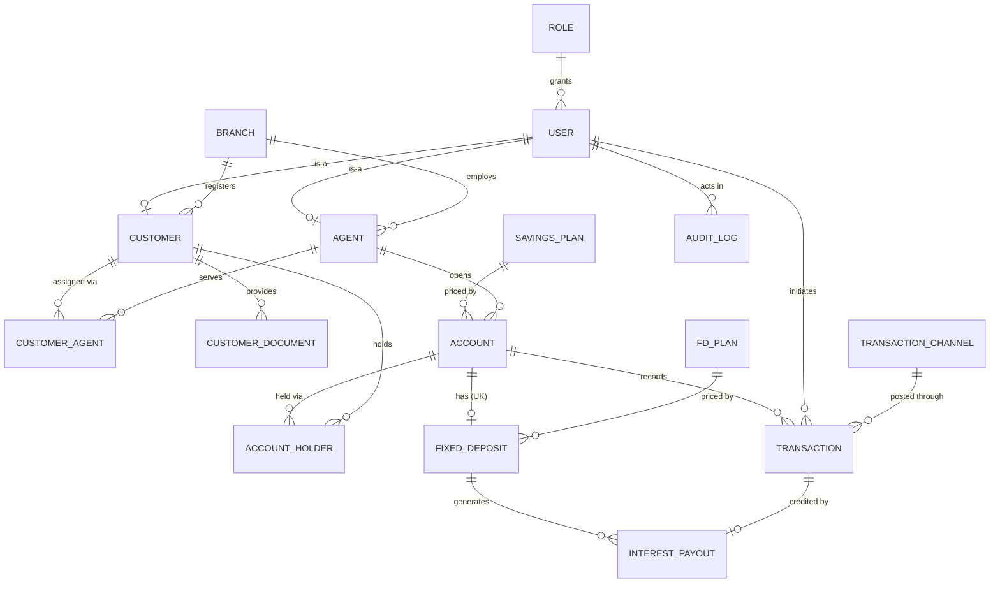

# 04 — Database Schema

**Baseline:** `group_32_ERD2` (16 tables). **Status:** Phase 1 implemented and verified;
Phase 2 entry approved 2026-10-05. Account and transaction schemas also exist (`0240`,
`0260`); customer/holder/mandate and later financial features remain planned.

This document has two clearly separated parts:

- **Part A — CURRENT ERD.** What our approved ERD actually says. Nothing invented.
- **Part B — PROPOSED CHANGES.** Every deviation, each traceable to a finding in
  `17_erd-gap-analysis.md`. **Nothing in Part B may be implemented until it is approved.**

> Rule: if you need a schema change that is not in Part A or an approved Part B item,
> stop. Add it to `17_erd-gap-analysis.md` and `.agent/open-questions.md` first. Do not
> invent schema in a migration.

**Conventions** (AGENTS.md §8): `snake_case`, singular table names, `uuid` surrogate PKs
via `gen_random_uuid()`, `TIMESTAMPTZ` for all instants, `money_amount`/`positive_money`/
`interest_rate` domains from migration `0000`, FKs to financial history are
`ON DELETE RESTRICT`.

---

# Part A — CURRENT ERD (16 tables)

## Entity map

```mermaid
erDiagram
    ROLE ||--o{ USER : "grants"
    USER ||--o| AGENT : "is-a"
    USER ||--o| CUSTOMER : "is-a"
    BRANCH ||--o{ AGENT : employs
    BRANCH ||--o{ CUSTOMER : registers
    CUSTOMER ||--o{ CUSTOMER_AGENT : "assigned via"
    AGENT ||--o{ CUSTOMER_AGENT : serves
    CUSTOMER ||--o{ CUSTOMER_DOCUMENT : provides
    SAVINGS_PLAN ||--o{ ACCOUNT : "priced by"
    AGENT ||--o{ ACCOUNT : opens
    ACCOUNT ||--o{ ACCOUNT_HOLDER : "held via"
    CUSTOMER ||--o{ ACCOUNT_HOLDER : holds
    ACCOUNT ||--o| FIXED_DEPOSIT : "has (UK)"
    FD_PLAN ||--o{ FIXED_DEPOSIT : "priced by"
    FIXED_DEPOSIT ||--o{ INTEREST_PAYOUT : generates
    TRANSACTION ||--o| INTEREST_PAYOUT : "credited by"
    ACCOUNT ||--o{ TRANSACTION : records
    USER ||--o{ TRANSACTION : initiates
    TRANSACTION_CHANNEL ||--o{ TRANSACTION : "posted through"
    USER ||--o{ AUDIT_LOG : "acts in"
```

## Reference and identity tables

### `role`
Application roles (SRS §2.4 defines seven user classes).

| Column | Type | Notes |
|---|---|---|
| `role_id` | uuid | **PK** |
| `role_name` | varchar(50) | **UK** |
| `description` | varchar(255) | |
| `status` | varchar(20) | `record_status` |

- Delete: `RESTRICT` — referenced by `user`.
- Index: PK plus the `role_name` unique index.
- Invariant: seeded rows cover every demonstrated role (SRS B.2).

### `user`
Authentication identity. **`user` is a reserved word in SQL** — the physical table will be
created as **`app_user`** (matching SRS §6.2, which already calls it `app_user`). The ERD
name is retained in diagrams.

| Column | Type | Notes |
|---|---|---|
| `user_id` | uuid | **PK** |
| `role_id` | uuid | **FK → role** |
| `username` | varchar(100) | **UK** |
| `password_hash` | varchar(255) | argon2id. Never logged, never returned by an API |
| `status` | varchar(20) | `record_status` |
| `registered_date` | date | |
| `last_login` | timestamptz | |

- Delete: `RESTRICT` — referenced by `transaction`, `audit_log`, `agent`, `customer`.
- Indexes: `username` unique; `(role_id, status)` for admin listing.
- Invariants: password is never plaintext (NFR-SEC); deactivate, never delete (FR-ORG-05).
- Branch membership is **not** stored on `app_user`. Users with role `AGENT` or
  `BRANCH_MANAGER` obtain their current branch from their required `agent` profile.

### `branch`

| Column | Type | Notes |
|---|---|---|
| `branch_id` | uuid | **PK**, defaults to `gen_random_uuid()` |
| `branch_code` | varchar(20) | **UK, NOT NULL** |
| `branch_name` | varchar(100) | **NOT NULL** |
| `address` | varchar(255) | **NOT NULL** |
| `district` | varchar(100) | **NOT NULL** |
| `phone` | varchar(20) | **NOT NULL** |
| `status` | `record_status` | **NOT NULL**, defaults to `ACTIVE` |
| `created_at` | timestamptz | **NOT NULL**, defaults to `now()` |
| `updated_at` | timestamptz | **NOT NULL**, maintained by `trg_branch_set_updated_at` |

- Implemented by `0120_p01_m02_branch.sql`; `0122_p01_m02_organization_audit.sql`
  adds same-transaction, sanitized master-data auditing.
- Delete: references use `ON DELETE RESTRICT`; the first such FK is added by the agent
  schema in P01-M02-T02. Deactivate referenced branches instead (FR-ORG-05).

### `agent`
Branch-staff subtype of `app_user` — `agent_id` is both PK and FK, so every branch staff
profile has a login. Both ordinary banking agents (`role_name = 'AGENT'`) and branch
managers (`role_name = 'BRANCH_MANAGER'`) use this profile; the role controls permissions.

| Column | Type | Notes |
|---|---|---|
| `agent_id` | uuid | **PK, FK → app_user(user_id), ON DELETE RESTRICT** |
| `branch_id` | uuid | **NOT NULL, FK → branch, ON DELETE RESTRICT** |
| `employee_no` | varchar(30) | **UK, NOT NULL** |
| `nic_passport_no` | varchar(50) | **UK, NOT NULL** |
| `full_name` | varchar(150) | **NOT NULL** |
| `date_of_birth` | date | **NOT NULL** |
| `gender` | varchar(20) | **NOT NULL** |
| `phone` | varchar(20) | **NOT NULL** |
| `address` | varchar(255) | **NOT NULL** |
| `email` | varchar(150) | **UK, NOT NULL** |
| `hired_date` | date | **NOT NULL** |
| `status` | `record_status` | **NOT NULL**, defaults to `ACTIVE` |
| `created_at` | timestamptz | **NOT NULL**, defaults to `now()` |
| `updated_at` | timestamptz | **NOT NULL**, maintained by `trg_agent_set_updated_at` |

- Implemented by `0121_p01_m02_agent.sql`; `0122_p01_m02_organization_audit.sql`
  adds same-transaction, sanitized master-data auditing.
- Delete: `RESTRICT`; future references from `account.opened_by_agent_id` and
  `customer_agent` also use `RESTRICT`.
- Index: `ix_agent_branch_status (branch_id, status)` for branch-scoped active-agent lists.
- Invariant: an active agent must reference an active branch. The agent trigger locks and
  validates the branch; the branch trigger rejects deactivation while active agents exist.
- Invariant: every active `AGENT` or `BRANCH_MANAGER` login must have one `agent` profile.
  Session validation obtains `branchId` by joining `app_user.user_id` to
  `agent.agent_id`; a missing profile fails closed with `403`, never bank-wide scope.
- Agent-management lists and agent-specific reports join `role` and restrict
  `role_name = 'AGENT'` when branch managers must not appear as ordinary agents.
- Branch, agent and linked `app_user` changes write before/after JSON to `audit_log` in
  the caller transaction. `password_hash`, `nic_passport_no` and `token_hash` are
  removed before audit persistence.

### `customer`
Subtype of `user` in the current ERD. G-20 is resolved by ADR-0007: migration 0220 implements
the approved independent identity described in Part B.4 instead of this ERD key shape.

| Column | Type | Notes |
|---|---|---|
| `customer_id` | uuid | **PK, FK → user(user_id)** |
| `branch_id` | uuid | **FK → branch** — home branch (FR-CUS-02) |
| `nic_passport_no` | varchar(50) | **UK** |
| `full_name` | varchar(150) | |
| `date_of_birth` | date | Drives plan eligibility (FR-ACC-02) |
| `gender` | varchar(20) | |
| `phone` | varchar(20) | |
| `address` | varchar(255) | |
| `email` | varchar(150) | **UK** |

- Delete: `RESTRICT`.
- Indexes: `nic_passport_no` unique (duplicate detection, SRS §6.7); `(branch_id)`;
  trigram index on `full_name` for search.
- Invariants: `date_of_birth` in the past; identity masked from unauthorised roles
  (FR-CUS-04); ≥ 15 customers seeded (FR-CUS-05).
- **Security:** RLS is enabled. Users with the `CUSTOMER` role can only see their own row. Staff users are restricted to their branch unless they have bank-wide roles (`ADMIN`, `CENTRAL_OPS`, `AUDITOR`).
- **Audit:** Monitored by `trg_audit_customer` which records all `INSERT` and `UPDATE` operations, masking PII in the `audit_log`.

### `customer_agent`
Effective-dated customer-to-agent assignment; preserves history (FR-CUS-03).

| Column | Type | Notes |
|---|---|---|
| `cust_agent_id` | uuid | **PK** |
| `customer_id` | uuid | **FK → customer** |
| `agent_id` | uuid | **FK → agent** |
| `assigned_date` | date | |
| `end_date` | date | NULL while current |
| `is_active` | boolean | ERD says `tinyint`; PostgreSQL uses `boolean` |

- Invariant: one current assignment (FR-CUS-02). Migration 0221's partial unique
  index enforces **at most one** active row (G-10); registration/reassignment must
  supply existence atomically. Exact implemented shape is below in B.4a.
- Check: `end_date IS NULL OR end_date >= assigned_date`.

### `customer_document`

| Column | Type | Notes |
|---|---|---|
| `doc_id` | uuid | **PK** |
| `customer_id` | uuid | **FK → customer** |
| `doc_type` | varchar(50) | |
| `file_path` | varchar(500) | Path only — no file contents in the database |
| `uploaded_date` | timestamptz | |
| `verified_by` | uuid | **FK → user**, NULL until verified |
| `verified_date` | timestamptz | |

- Check: `(verified_by IS NULL) = (verified_date IS NULL)` — both set, or neither.
- Implemented in 0222 with RESTRICT FKs and lifecycle timestamps; see B.4a.
- ERD Assumption 3: documentation is required to open an account — enforced in
  `sp_open_savings_account`, not by a constraint.

## Product tables

### `savings_plan`

Implemented by `0140_p01_m03_savings_plan.sql`.

| Column | Type | Notes |
|---|---|---|
| `plan_id` | uuid | **PK** |
| `plan_name` | varchar(100) | **UK** — Children / Teen / Adult / Senior / Joint |
| `interest_rate` | `interest_rate` | 0.1200 / 0.1100 / 0.1000 / 0.1300 / 0.0700 |
| `min_balance` | `money_amount` | 0 / 500 / 1000 / 1000 / 5000 |
| `description` | varchar(255) | |
| `status` | varchar(20) | `CHECK IN ('ACTIVE','INACTIVE')` |
| `min_age_years` | int | NULL = no lower bound |
| `max_age_years` | int | NULL = no upper bound |
| `min_holders` | int | default `1` |
| `max_holders` | int | default `1` |
| `requires_all_adult` | boolean | default `false` — every holder of this plan must be 18+ |

- Delete: `RESTRICT` — referenced by `account`.
- Invariant: rates and minimums exactly match BR-03…BR-07.
- Checks: `chk_savings_plan_age_range` (`max_age_years >= min_age_years` where both set),
  `chk_savings_plan_holder_range` (`max_holders >= min_holders`),
  `chk_savings_plan_min_balance_nonneg` (`min_balance >= 0`).
- Age bounds and holder counts (**G-13**) are resolved — data-driven eligibility, no
  hardcoded `plan_name` branching. See `docs/17_erd-gap-analysis.md` G-13.

### `fd_plan`

| Column | Type | Notes |
|---|---|---|
| `fd_plan_id` | uuid | **PK** |
| `plan_name` | varchar(100) | **UK** |
| `tenure_months` | int | 6 / 12 / 36 |
| `interest_rate` | `interest_rate` | 0.1300 / 0.1400 / 0.1500 |
| `description` | varchar(255) | |
| `status` | varchar(20) | `record_status` |

- Check: `tenure_months > 0`.
- Invariant: exactly the three products in BR-13.

### `transaction_channel`

Implemented by immutable migration `0160_p01_m04_transaction_channel.sql`, verified
at Phase 1 closeout. `channel_name` is NOT NULL/UNIQUE; status defaults to `ACTIVE`
and is constrained to `ACTIVE`/`INACTIVE`; `created_at` is TIMESTAMPTZ NOT NULL.

| Column | Type | Notes |
|---|---|---|
| `channel_id` | uuid | **PK** |
| `channel_name` | varchar(100) | **UK** — e.g. `BRANCH_COUNTER`, `ONLINE`, `SYSTEM` |
| `status` | varchar(20) | `record_status` |

- `SYSTEM` is the channel used by the central interest run.

## Account tables

### `account`

| Column | Type | Notes |
|---|---|---|
| `account_id` | uuid | **PK** |
| `plan_id` | uuid | **FK → savings_plan** |
| `branch_id` | uuid | **FK → branch**, NOT NULL — owning branch fixed at opening (G-06, ADR-0008) |
| `opened_by_agent_id` | uuid | **FK → agent** |
| `account_number` | varchar(50) | **UK** (SRS §6.7); generated by `fn_next_account_number` as `<BRANCH_CODE>-<8 digits>` |
| `opened_date` | date | |
| `status` | varchar(20) | `ACTIVE` / `FROZEN` / `CLOSED` |
| `current_balance` | `money_amount` | NOT NULL DEFAULT 0, `CHECK (>= 0)` — controlled balance (G-18) |
| `created_at` / `updated_at` | timestamptz | `updated_at` maintained by `trg_account_set_updated_at` |

- Delete: `RESTRICT` — referenced by `transaction`, `account_holder`, `fixed_deposit`.
- Indexes: `account_number` unique; `(plan_id)`; `(branch_id, status)` (ADR-0008); `(status)`.
- Rows are created only by `sp_open_savings_account` (0243), which writes the account, holders, mandate and optional initial deposit atomically.
- Implemented in `0240_p02_m03_account.sql` (P02-M03-T01). `trg_account_prevent_branch_change` rejects any `UPDATE` of `branch_id` (SQLSTATE `23514`, `ck_account_branch_immutable`). `trg_account_close_guard` (`0441`, P04-M03-T02) rejects a move to `CLOSED` unless `current_balance = 0` and no `ACTIVE` fixed deposit exists (SQLSTATE `P0001`, `ck_close_account_balance` / `ck_close_account_active_fd`).
- Invariants: balance never negative (NFR-SAFE-01); balance ≥ plan minimum after a
  withdrawal (NFR-SAFE-02); closing requires zero balance and no active FD (FR-ACC-05,
  BR-18).
- **Security:** RLS is enabled. Users with the `CUSTOMER` role can only see accounts they hold. Staff users are restricted to accounts within their branch, unless they hold bank-wide roles (`ADMIN`, `CENTRAL_OPS`, `AUDITOR`).
- **Audit:** Monitored by `trg_audit_account` which records all `INSERT` and `UPDATE` operations, masking any potential PII in the `audit_log`.
- Approved changes: add immutable-at-opening `branch_id` (**G-06**, ADR-0008) and the
  non-negative `CHECK` (**G-18**). See Part B.

### `account_holder`
Intersection resolving the many-to-many between customers and accounts. This is what makes
joint accounts possible (SRS §6.3).

| Column | Type | Notes |
|---|---|---|
| `account_holder_id` | uuid | **PK** |
| `account_id` | uuid | **FK → account** |
| `customer_id` | uuid | **FK → customer** |
| `holder_type` | varchar(20) | `PRIMARY` / `JOINT`, default `PRIMARY` (**G-08**, ADR-0009) |
| `joined_date` | date | default `CURRENT_DATE` |
| `created_at` | timestamptz | |
| — | | **UK (account_id, customer_id)** |

- The composite unique key prevents the same customer being added twice to one account.
- Delete: `RESTRICT` on both foreign keys.
- Indexes: PK; `uq_account_holder_account_customer`; partial unique
  `uq_account_holder_one_primary (account_id) WHERE holder_type = 'PRIMARY'`;
  `ix_account_holder_customer (customer_id)`.
- Implemented in `0241_p02_m03_account_holder.sql` (P02-M03-T02). An account has at most
  one `PRIMARY` holder; additional holders are `JOINT`.
- The cross-row rule — a joint account has 2–4 adult holders and a mandate — cannot be a
  row `CHECK`. It is enforced by `trg_validate_joint_mandate` (P02-M03-T03, migration
  `0242`) and `sp_open_savings_account` (P02-M03-T04), not by this table alone
  (**G-08**, ADR-0009). The statement-level triggers (`AFTER INSERT` and `AFTER UPDATE`,
  both calling `fn_check_account_holder_sets`) read `savings_plan.min_holders`,
  `max_holders` and `requires_all_adult`, require exactly one `PRIMARY`, and reject a
  holder under 18 when the plan requires adults. The checker first locks the account row
  (`FOR NO KEY UPDATE`), so concurrent holder changes on one account are serialised. All
  holders of an account must be inserted in **one multi-row `INSERT`** because the check
  runs once per statement. Errors are `P0001` with a message prefix and a named
  `CONSTRAINT`: `INVALID_HOLDER_COUNT` (`ck_account_holder_count`), `MISSING_PRIMARY_HOLDER`
  (`ck_account_holder_one_primary`), `UNDERAGE_HOLDER` (`ck_account_holder_adult`).

### `account_opening_request`

| Column | Type | Notes |
|---|---|---|
| `request_id` | uuid | **PK** |
| `user_id` | uuid | **FK → app_user** — the user who sent the key |
| `idempotency_key` | varchar(80) | `CHECK` 8–80 chars `[A-Za-z0-9_-]` |
| `request_hash` | char(64) | SHA-256 (hex) of the canonical request; detects a reused key with a different body |
| `account_id` | uuid | **FK → account, UK** — the account this request opened |
| `created_at` | timestamptz | |
| — | | **UK (user_id, idempotency_key)** |

- Implemented in `0244_p02_m03_account_opening_request.sql` (P02-M03-T05). Insert-only (`mims_app` has no `UPDATE`/`DELETE`); `RESTRICT` on both foreign keys.
- Written in the same transaction as the account, so a failed open leaves no key. The service takes `pg_advisory_xact_lock` on (user, key) before reading, so concurrent requests with one key serialise; the unique constraint is the backstop. This is the account-opening counterpart of G-04's `transaction.idempotency_key`.

### `joint_mandate`

| Column | Type | Notes |
|---|---|---|
| `mandate_id` | uuid | **PK** |
| `account_id` | uuid | **FK → account, UK** — one mandate per account |
| `mandate_type` | varchar(20) | `ANY_ONE` / `ALL_HOLDERS` |
| `required_signatories` | int | default 1; `CHECK` 1–4; `ANY_ONE` must be 1 |
| `effective_from` | date | default `CURRENT_DATE` |
| `effective_to` | date | nullable; `CHECK` not before `effective_from` |
| `created_at` / `updated_at` | timestamptz | `updated_at` maintained by `set_updated_at` |

- Implemented in `0242_p02_m03_joint_mandate.sql` (P02-M03-T03, **G-08**, ADR-0009).
- Delete: `RESTRICT` on the account foreign key; `mims_app` has no `DELETE` grant.
- `trg_joint_mandate_fit` (row-level, after insert/update): the account's plan must allow
  more than one holder, signatories cannot exceed holders, and `ALL_HOLDERS` equals the
  holder count at the time the mandate is stored. Constraint names:
  `ck_joint_mandate_multi_holder_plan`, `ck_joint_mandate_signatories_fit`.
- When holders are added or changed, the holder trigger sets an `ALL_HOLDERS` mandate's
  `required_signatories` to the new holder count, so the stored mandate never goes stale.
  `ANY_ONE` stays 1.
- The trigger functions are `SECURITY DEFINER` (they must see every holder and customer
  regardless of the caller's RLS scope) with `EXECUTE` revoked from `PUBLIC`.
- "A joint account must have a mandate" cannot live in the holder trigger (holders are
  inserted first); `sp_open_savings_account` (T04) writes holders then the mandate in one
  transaction. Audit and RLS for this table are not yet bound (follow-up for M1).

### `fixed_deposit`

| Column | Type | Notes |
|---|---|---|
| `fd_id` | uuid | **PK** |
| `account_id` | uuid | **FK → account, UK** ← see **G-01** |
| `fd_plan_id` | uuid | **FK → fd_plan** |
| `principal_amount` | `positive_money` | |
| `start_date` | date | |
| `next_interest_date` | date | Advanced by 30 days on each payout |
| `status` | varchar(20) | `ACTIVE` / `MATURED` / `CLOSED` |

- Indexes: `(status, next_interest_date)` — selects FDs due for interest (SRS §6.7).
- Invariants: the linked account is `ACTIVE` at opening (FR-FD-01); one *active* FD per
  account (BR-12 — **the ERD's plain `UNIQUE` says one FD ever; G-01**); ≥ 10 FDs seeded
  (FR-FD-05).
- Gaps: no `maturity_date` (**G-23**, folded into Part B); no rate snapshot (**G-11**).

## Financial tables

### `transaction`
The ledger. Immutable once posted (FR-TXN-02, BR-16).

| Column | Type | Notes |
|---|---|---|
| `transaction_id` | uuid | **PK** |
| `account_id` | uuid | **FK → account** |
| `initiated_by_user_id` | uuid | **FK → user** |
| `agent_id` | uuid NULL | **FK → agent**, ON DELETE RESTRICT; reporting snapshot (0320, G-07) |
| `branch_id` | uuid NULL | **FK → branch**, ON DELETE RESTRICT; posting-branch snapshot (0320, G-07) |
| `channel_id` | uuid | **FK → transaction_channel** |
| `reference_number` | varchar(50) | **UK** per BR-10 / G-05 (ADR-0010); generated by `fn_next_transaction_reference()` |
| `transaction_type` | varchar(50) | `DEPOSIT` / `WITHDRAWAL` / `INTEREST_CREDIT` / `REVERSAL` (FR-TXN-01) |
| `amount` | numeric(15,2) | Always positive; direction comes from the type |
| `transaction_date` | timestamptz | Business timestamp |
| `narration` | varchar(255) | |
| `balance_after` | numeric(15,2) NULL | Balance after this row (G-14, added by `0361`). **Nullable:** opening deposits written by `sp_open_savings_account` before `0541` have NULL and cannot be corrected (immutable ledger); RPT-02 derives them |
| `ledger_seq` | bigint | **NOT NULL**, default `nextval('transaction_ledger_seq')` (`0542`, G-24, ADR-0023): posting order of the row, unique per account; internal, never displayed |
| `idempotency_key` | varchar(80) | Nullable; partial unique index `ux_transaction_idempotency` (G-04) |
| `created_at` | timestamptz | System insert time |

- Delete: **never**. `RESTRICT` everywhere, and a trigger rejects `UPDATE`/`DELETE`.
- Indexes: `(account_id, transaction_date DESC)` for statements;
  `ux_transaction_reference` unique (`reference_number`, SRS §6.7, G-05);
  `ux_transaction_idempotency` partial unique on `idempotency_key WHERE idempotency_key IS NOT NULL` (G-04);
  `ix_transaction_agent_date (agent_id, transaction_date)` and
  `ix_transaction_branch_date (branch_id, transaction_date)` for reporting (0320, G-07);
  `ux_transaction_account_ledger_seq` unique `(account_id, ledger_seq)` for the strict per-account posting order RPT-02 needs (0542, G-24).
- Implemented in `0260_p02_m04_transaction.sql`, `0320_p03_m02_transaction_attribution.sql`,
  `0360_p03_m04_transaction_reference_idempotency.sql` (P03-M04-T01), and
  `0361_p03_m04_sp_post_deposit.sql` (P03-M04-T02).
- Invariants: `amount > 0`; no row may be updated or deleted by an application role;
  every row has a unique reference, timestamp and type (BR-10).
- Gaps: no reversal link (**G-02**); no `status` (**G-02**). G-04, G-05, G-07, G-14 and G-24 are resolved.

**G-07 implementation:** M2 migration `0320_p03_m02_transaction_attribution.sql`
adds nullable posting-time attribution under ADR-0016. Existing rows and omitted
INSERT columns retain NULL values; there is no backfill or derived membership.
Both fields are protected by the existing ledger immutability trigger. FKs ensure
referential integrity, not authorization or required attribution. M4 posting routines
and M3 opening-deposit producers still need to capture trusted attribution; existing
opening deposits remain unattributed. M1 retains transaction RLS/scope ownership.

### `transaction_reversal`

Implemented in `0363_p03_m04_transaction_reversal.sql`. Links an original transaction to its compensating entry, resolving G-02 without requiring a mutable status column on the ledger.

| Column | Type | Notes |
|---|---|---|
| `reversal_id` | uuid | **PK** |
| `original_transaction_id` | uuid | **FK → transaction, UK** — enforces "reversible once" |
| `reversal_transaction_id` | uuid | **FK → transaction, UK** — the compensating transaction |
| `reason` | varchar(255) | |
| `reversed_by_user_id` | uuid | **FK → user** |
| `created_at` | timestamptz | |

- Delete: `RESTRICT` on all foreign keys.
- Immutability: The transaction ledger remains completely immutable. Reversal state is derived dynamically by joining to this table.

### `interest_payout`

| Column | Type | Notes |
|---|---|---|
| `interest_id` | uuid | **PK** |
| `fd_id` | uuid | **FK → fixed_deposit**, NOT NULL ← see **G-12** |
| `transaction_id` | uuid | **FK → transaction, UK** |
| `payout_date` | date | |
| `interest_amount` | numeric(15,2) | |

- The `UNIQUE` on `transaction_id` implements SRS §6.3: each distribution links to exactly
  one `INTEREST_CREDIT` ledger entry.
- Gaps: no run linkage or cycle key (**G-03**); cannot represent savings interest
  (**G-12**).

### `audit_log`

| Column | Type | Notes |
|---|---|---|
| `log_id` | uuid | **PK** |
| `user_id` | uuid | **FK → user** — NULL needed for system actions (**G-22**, Part B) |
| `entity_type` | varchar(100) | |
| `entity_id` | uuid | |
| `action` | varchar(50) | |
| `old_values` | jsonb | ERD says `json`; use `jsonb` for indexing |
| `new_values` | jsonb | |
| `ip_address` | varchar(45) | IPv6-capable length |
| `logged_at` | timestamptz | |

- Append-only. No `UPDATE`, no `DELETE`, for any application role.
- Indexes: `(user_id, logged_at DESC)` and `(entity_type, entity_id)` (SRS §6.7).
- Invariant: sensitive values are masked before being written (NFR-SEC-05).

---

# Part B — PROPOSED CHANGES (require approval)

Every item traces to `17_erd-gap-analysis.md`. **Do not implement anything here until the
corresponding open question is resolved and an ADR exists.**

## B.1 New tables (7)

| Table | Purpose | Gap | Owner |
|---|---|---|---|
| `interest_run` | One row per 30-day cycle. `UNIQUE(cycle_date)` prevents duplicate runs; stores counts, totals, exceptions (FR-INT-05) | G-03 | M5 |
| `joint_mandate` | `ANY_ONE` / `ALL_HOLDERS` operating rule per joint account (FR-ACC-04, BR-17; approved ADR-0009) | G-08 | M3 |
| `system_parameter` | Business hours, withdrawal limits as data, not code (BR-08, §7.1) | G-15 | M1 |
| `business_calendar` | Working days and open/close times | G-15 | M1 |
| `user_session` | Server-side session records so sessions can be invalidated (FR-AUTH-04) | G-16 | M1 |
| `login_attempt` | Failed sign-in throttling (FR-AUTH-03) | G-17 | M1 |

**16 current + 7 proposed = 23 tables.**

## B.2 Column additions

| Table | Column | Reason | Gap |
|---|---|---|---|
| `account` | `branch_id uuid NOT NULL FK` | Owning branch fixed at opening; RLS anchor (FR-ACC-01; approved ADR-0008) | G-06 |
| `transaction` (0320 implemented) | `agent_id uuid NULL FK` | RPT-01 reporting agent captured at posting time; ADR-0016 | G-07 |
| `transaction` (0320 implemented) | `branch_id uuid NULL FK` | Historical posting branch; ADR-0016 | G-07 |
| `transaction` | `idempotency_key varchar(80) NULL` | FR-DEP-04, AC-06 | G-04 |
| `transaction` | `balance_after money_amount NOT NULL` | FR-TXN-04 running-balance evidence | G-14 |
| `transaction` | `status varchar(20)` | **REJECTED**: Reversal state is derived purely via `transaction_reversal` to preserve the trigger immutability. | G-02 |
| `fixed_deposit` | `maturity_date date NOT NULL` | FR-FD-04, RPT-03 | G-23 |
| `fixed_deposit` | `interest_rate_at_opening interest_rate NOT NULL` | Rate fixed at opening; protects historical payouts (BR-19) | G-11 |
| `interest_payout` | `interest_run_id uuid FK`, `cycle_date date` | Cycle idempotency | G-03 |
| `savings_plan` (implemented) | `min_age_years`, `max_age_years`, `min_holders`, `max_holders`, `requires_all_adult` | Data-driven eligibility (FR-ACC-02) | G-13 |
| `savings_plan`, `fd_plan` (implemented) | `effective_from`, `effective_to` | Effective-dated products (BR-19) | G-11 |
| `branch` | `branch_code varchar(20) UNIQUE` | §4.2 requires unique branch codes | — |
| `agent` | `employee_no varchar(30) UNIQUE`, `hired_date`, `status` | §4.2 unique employee numbers, FR-ORG-03 | — |
| `account_holder` | `holder_type varchar(20)` | `PRIMARY` / `JOINT` (approved ADR-0009) | G-08 |
| `audit_log` | `user_id` made NULL-able, `actor_type varchar(20)` | System-posted interest runs have no user | G-22 |

## B.3 Constraint changes

| Change | Reason | Gap | Approval |
|---|---|---|---|
| `fixed_deposit`: replace `UNIQUE(account_id)` with partial unique index `WHERE status='ACTIVE'` | One *active* FD, not one ever | G-01 | **Blocking** |
| `transaction.reference_number` → `UNIQUE NOT NULL` | BR-10, FR-DEP-02 | G-05 | **Blocking** |
| `account.current_balance` → `NOT NULL DEFAULT 0 CHECK (>= 0)` | NFR-SAFE-01 | G-18 | No |
| Partial unique index on `customer_agent(customer_id) WHERE is_active` — implemented 0221; at most one active | FR-CUS-02 | G-10 | No |
| `interest_payout`: `UNIQUE(fd_id, cycle_date)` | FR-INT-03, NFR-SAFE-03 | G-03 | Yes |
| Apply `money_amount` / `positive_money` / `interest_rate` domains throughout | SRS §6.1 | G-19 | No |

## B.4 Identity change (approved)

`customer.customer_id` becomes an independent surrogate PK with an optional
`app_user_id uuid NULL UNIQUE FK → app_user`, instead of `PK,FK`. **Approved by ADR-0007**
on 2026-09-29: customer login is optional and most customers are agent-managed. `agent`
keeps the subtype pattern.

### Approved customer schema — P02-M02-T01

The approved task card specifies this physical shape, replacing only Part A's
customer subtype. Migration `0220_p02_m02_customer.sql` implements it.

| Column | Type | Constraints |
|---|---|---|
| `customer_id` | uuid | PK, defaults to gen_random_uuid(); independent of login |
| `app_user_id` | uuid | NULL, UNIQUE, FK to app_user(user_id), ON DELETE RESTRICT |
| `branch_id` | uuid | NOT NULL, FK to branch, ON DELETE RESTRICT |
| `customer_number` | varchar(30) | NOT NULL, UNIQUE; T04 assigns CUS- plus 24 uppercase random hex digits (ADR-0014) |
| `nic_passport_no` | varchar(50) | NOT NULL, UNIQUE |
| `full_name` | varchar(150) | NOT NULL |
| `date_of_birth` | date | NOT NULL, CHECK before CURRENT_DATE |
| `gender` | varchar(20) | NULL |
| `phone` | varchar(20) | NULL |
| `address` | varchar(255) | NULL |
| `email` | varchar(150) | NOT NULL, UNIQUE |
| `status` | varchar(20) | NOT NULL, default ACTIVE; CHECK ACTIVE/INACTIVE |
| `created_at` | timestamptz | NOT NULL, default now() |
| `updated_at` | timestamptz | NOT NULL, default now(); shared set_updated_at trigger |

Indexes: `ix_customer_branch` B-tree on branch_id and `ix_customer_full_name_trgm`
GIN on full_name using gin_trgm_ops. Named constraints provide deterministic error
mapping. SQL uniqueness is exact/case-sensitive; T04 registration normalizes identity
to uppercase and email to lowercase, and read services mask identity for branch staff.
Existing mixed-case rows are not rewritten by this task. Assignment/document FKs are
implemented in 0221/0222; T04 inserts a minimal customer creation audit in its transaction.
Holder FKs, generic audit triggers, RLS and runtime grants remain separately assigned.
T04 adds no database objects or migration; see the registration handoff.

Verified 2026-10-05: 27 customer constraints/search/rollback tests and 38 organization
regressions pass. All 12 migrations rebuild from empty and local 0220 applies without
reset. Complete contract: `.agent/handoffs/p02-m02-t01-customer-schema.md`.

### B.4a Implemented customer relations — P02-M02-T02/T03

`0221_p02_m02_customer_agent.sql`:

| Column | Type | Constraints |
|---|---|---|
| `cust_agent_id` | uuid | PK, default gen_random_uuid() |
| `customer_id` | uuid | NOT NULL, FK customer(customer_id), ON DELETE RESTRICT |
| `agent_id` | uuid | NOT NULL, FK agent(agent_id), ON DELETE RESTRICT |
| `assigned_date` | date | NOT NULL, default CURRENT_DATE |
| `end_date` | date | NULL; CHECK NULL or >= assigned_date |
| `is_active` | boolean | NOT NULL, default true |
| `created_at` | timestamptz | NOT NULL, default now() |
| `updated_at` | timestamptz | NOT NULL, default now(); set_updated_at trigger |

`ux_customer_agent_one_active` is UNIQUE on customer_id WHERE is_active. It rejects
competing active INSERT/UPDATEs, including concurrent transactions. It does not require
an assignment to exist. Implemented T04 registration guarantees one at successful
commit; future reassignment must preserve existence and keep closed rows. Direct
owner SQL can still create an unassigned customer. B-tree indexes ix_customer_agent_customer/ix_customer_agent_agent
serve full history, assigned-customer lists and FK checks.

`0222_p02_m02_customer_document.sql`:

| Column | Type | Constraints |
|---|---|---|
| `doc_id` | uuid | PK, default gen_random_uuid() |
| `customer_id` | uuid | NOT NULL, FK customer(customer_id), ON DELETE RESTRICT |
| `doc_type` | varchar(50) | NOT NULL |
| `file_path` | varchar(500) | NOT NULL; metadata path only |
| `uploaded_date` | timestamptz | NOT NULL, default now() |
| `verified_by` | uuid | NULL, FK app_user(user_id), ON DELETE RESTRICT |
| `verified_date` | timestamptz | NULL; paired with verified_by by CHECK |
| `created_at` | timestamptz | NOT NULL, default now() |
| `updated_at` | timestamptz | NOT NULL, default now(); set_updated_at trigger |

`ck_customer_document_verification` requires both verification fields set or both
NULL. ix_customer_document_customer supports profile/document-eligibility lookup.
The database stores no binary content. M3 must enforce documentation eligibility at
account opening. These tables add AGENTS.md-required timestamps beyond the abbreviated
ERD; see docs/17 and the reconciliation note in .agent/open-questions.md.

Server-only verifyDocument uses authenticated staff identity, branch/assignment predicates,
row locks and a same-transaction minimal audit event. The original 0221/0222 migrations
add no grants; verification is not exposed by T05 and still needs its runtime lock/grant integration.
Verified 2026-10-05: 134 selected tests pass, all 14 migrations rebuild/reapply/verify,
typecheck/lint pass. See the [relation handoff](../.agent/handoffs/p02-m02-t02-t03-customer-agent-document.md).

**T05 runtime access — 0223_p02_m02_customer_child_access.sql (new, M2 block):**
enables RLS and grants mims_app SELECT/INSERT on customer_agent/customer_document.
SELECT requires a parent customer visible under M1's branch/bank-wide/optional-login
scope helpers. INSERT requires branch staff and an in-branch parent; AGENT assignments
must name the current user, and document verification fields must both be null.
No child UPDATE/DELETE or role UPDATE is granted. Services impose stricter current
assignment predicates on agent reads. M1's merged 0200/0201/0261 supply parent
policies, helper functions and sanitized customer audit; T05 reuses these without
changing merged migrations. See ADR-0015 and the M1 coordination handoff.

## B.5 Denormalisation register

SRS §6.1 requires intentional denormalisation to be documented. Four entries:

| # | Denormalised value | Derivable from | Why it is kept | Control |
|---|---|---|---|---|
| D-1 | `account.current_balance` | `SUM` of signed ledger amounts | Recomputing on every withdrawal does not scale and makes `FOR UPDATE` locking awkward; a single locked row serialises concurrent withdrawals cleanly | `CHECK (>= 0)`; only posting routines may write it; Phase 5 reconciliation view `vw_reconciliation_balance` asserts equality with the ledger |
| D-2 | `transaction.balance_after` | Window function over prior rows | FR-TXN-04 balance evidence; O(1) statement rendering; survives reversal ordering ambiguity | Written inside the same locked transaction; reconciliation view `vw_reconciliation_running_balance` compares against the window-function result |
| D-3 | `fixed_deposit.interest_rate_at_opening` | `fd_plan.interest_rate` | Rates are effective-dated (BR-19); reading through the plan would retroactively change historical payouts | `NOT NULL`; set once at opening; never updated |
| D-4 | `account.branch_id` | Opening agent's branch at account creation | Branch ownership must not drift when an agent transfers; it is the RLS and historical-report anchor | `NOT NULL FK`; assigned from trusted branch scope at opening; never changed |

All four remain **3NF-compliant by design intent**: the ledger stays authoritative and
each denormalised value is reconciled against its source in Phase 5.

## B.6 Normalisation position

| Form | How the design satisfies it |
|---|---|
| **1NF** | All attributes atomic. Repeating holders, documents, transactions and payouts live in child tables — no arrays, no comma-separated fields. |
| **2NF** | Intersection rows have surrogate PKs. `account_holder` has composite uniqueness; `customer_agent` uses partial customer uniqueness for current assignments and permits repeated historical assignments. Each row's attributes depend on its key. |
| **3NF** | Plan rates, minimum balances, branch details and FD product terms are stored once and referenced by FK. No transitive dependency — e.g. `account` stores `plan_id`, never a copy of `interest_rate`. |
| **Documented exceptions** | D-1, D-2, D-3 above. Each is a controlled, reconciled denormalisation, not an oversight. |

## Customer FD listing view (P04-M02-T01, ADR-0018)

Migration 0420 defines owner-only fn_install_customer_fd_summary; the post-migration
views stage binds vw_customer_fd_summary after 0480 on a clean rebuild. On an existing
FD schema the migration binds immediately. The view joins customer → account_holder
→ account → fixed_deposit → fd_plan; unique holder membership means one row per
(customer_id, fd_id), including a separate relation for each joint-account holder.
It exposes customer/account branch IDs, account ID/number, FD ID/product name,
principal, stored opening rate, start_date, maturity_date, next_interest_date and
status. The task card's opened_date example is superseded by the actual start_date.

PostgreSQL security_invoker/security_barrier retain caller RLS. 0420 also enables
SELECT-only FD RLS through scoped accounts/customer holders and grants only the
listed FD columns and view SELECT to mims_app. Unset context sees no rows; AGENT
needs a current customer assignment plus matching customer/account branch, manager
needs both branches, CUSTOMER sees self, CENTRAL_OPS/AUDITOR read bankwide.
No FD write grant/policy, ledger change, opening change or seed is introduced.
M1/M5 security integration handoff: ../.agent/handoffs/p04-m02-customer-fd-listing.md.

### Current FD read actor (P04-M02-T02, ADR-0019)

0421 adds fn_customer_fd_actor_is_current(), STABLE SECURITY INVOKER with explicit
runtime EXECUTE and no PUBLIC grant. An additive RESTRICTIVE SELECT-only policy
requires active stored user/role matching transaction context; AGENT/BRANCH_MANAGER
also need an active staff profile/branch matching the current branch claim. Missing
identity, role escalation and stale branch context see no FD rows even via direct
SELECT. Existing 0420 assignment/customer/account/self row scope remains authoritative.
CENTRAL_OPS/AUDITOR and CUSTOMER do not inherit a retained staff profile's restrictions.

Owner-only fn_install_customer_fd_scope_guard() follows 0420's late binder, invoked
after the listing installer in the existing views file on a clean rebuild and directly
on an existing FD schema. No merged migration, table column, write grant/policy or
financial state changes. This checks trusted context consistency, not session tokens.
M1/M5 policy review: ../.agent/handoffs/p04-m02-fd-branch-scope.md.

## RPT-01 agent transaction view (P05-M02-T01, ADR-0020)

Migration `0520_p05_m02_rpt01_view.sql` creates `vw_rpt01_agent_transactions`.
Its grain is `(agent_id, branch_id, transaction_type, transaction_date)`: exact
posting timestamps remain available for filtering before final report totals.

| Columns | Meaning |
|---|---|
| `agent_id`, `employee_no`, `agent_name`, `agent_status` | Current profile metadata for every attribution identity in `agent`, including inactive and manager profiles |
| `agent_branch_id`, `agent_branch_name` | Current roster branch; never historical scope |
| `branch_id`, `branch_name` | Captured posting branch; NULL remains NULL |
| `transaction_type`, `transaction_date` | Posted type and exact timestamp; NULL for an empty-history roster row |
| `transaction_count` | bigint COUNT(transaction_id); zero for an empty-history roster row |
| `total_value` | Unbounded NUMERIC SUM(amount), zero `0.00` for an empty-history roster row; unsigned by type |

No agent attribution is inferred for NULL `transaction.agent_id`. No current-role
or active-status filter removes historical totals. Multiple postings with identical
agent/branch/type/timestamp share one aggregate row. There is no new table or index.

For range-specific zeros, LEFT JOIN the eligible agent roster to date/branch-filtered
view facts, then aggregate counts and values. Convert inclusive Colombo dates to
half-open timestamp bounds. The branch roster includes current members plus agents
with matching historical posting-branch facts; transferred history is not lost.
The corrected consumer contract is in `../2_Vibodha/09_P5_rpt01-report.md` and its
SQL regression tests. Do not filter an all-time outer join afterwards.

The view has `security_invoker=true` and `security_barrier=true` and no SELECT grant
to PUBLIC or mims_app. Runtime access is now through the guarded aggregate functions
below; no direct view grant is introduced. The view itself retains unsigned type totals.

## RPT-01 runtime integration (P05-M02-T02, ADR-0022)

New M2 migration `0521_p05_m02_rpt01_runtime.sql` adds `fn_rpt01_scope(uuid)`,
`fn_rpt01_rows(date,date,uuid,uuid)` and `fn_rpt01_exclusions(date,date,uuid)`.
The guard checks current active stored user/role and, for managers, an active
profile/branch matching transaction-local context. Managers cannot request another
branch; ADMIN/CENTRAL_OPS/AUDITOR may request one branch or bankwide totals.
The two SECURITY DEFINER readers pin search_path, fully qualify relations, revoke
PUBLIC EXECUTE and expose fixed aggregate DTOs through mims_app EXECUTE only.

Rows group by agent and captured posting branch, preserving inactive/transferred
identities and range-specific roster zeros. They include exact counts and values
for deposits, withdrawals, interest and reversals, reversal credits/debits,
unresolved reversal count and net. A valid transaction_reversal link determines
direction; an absent/invalid original link makes net NULL. Exclusions separately
count/sum NULL-agent rows within dates/branch, independently of the agent filter.
All aggregate counts/values become strings in the API; no money arithmetic uses JS.

The 0520 view remains private. No new table, column, raw ledger grant or financial
write is added. Global transaction RLS remains a separate M1/M4 integration gap;
the execute-only report scope guard is the database backstop for this capability.

## Withdrawal corrective routine contract (P03-M04-T03, ADR-0021)

New M4 migration 0363 replaces the broken 0362 definitions without changing merged
migrations or table shape. `sp_post_withdrawal` retains the single-customer signature
and adds an array-signers overload for I-4/ALL_HOLDERS. `sp_try_post_withdrawal` is
the array-signers audited entry, adding `p_rejection_code` to the four financial OUT
fields. All are SECURITY INVOKER with explicit mims_app EXECUTE and no PUBLIC grant.

Success locks the account before financial decisions and atomically writes an
attributed WITHDRAWAL row with exact balance_after, debits account.current_balance
and writes audit_log.new_values. No after_value column is added. AGENT attribution
comes from its verified profile; manager/admin/customer do not become reporting
agents automatically. Branch comes from trusted staff scope or the locked account.
Existing legacy/system attribution is unchanged. Per-key serialization and exact
payload/signers replay checking preserve one effect; the existing unique index
remains the cross-producer backstop. Positive finite cents, current actor/scope,
active channel, business calendar, real parameter keys, Colombo-day limits, mandate
and minimum are validated in the transaction.

Known financial rejection: inner financial subtransaction rolls back, outer audit
is written via CALL sp_write_rejection_audit, and the attempt returns a code with
NULL financial outputs. The future service commits this audit-only result through
withTransaction, then throws/maps the safe domain error outside it. Unexpected
errors abort all effects. A legacy throwing call cannot preserve its audit through
a caller rollback. No autonomous transaction, new table or live API is introduced.
