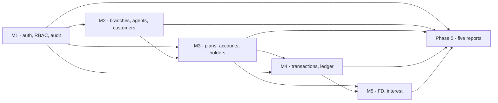

# 08 — Workload Division

**Team:** 5 members · **Phases:** 6 · **Model:** vertical slices

---

## The rule that shapes everything

**We do not divide by layer.** Nobody is "the frontend person" or "the database person".
Each member owns a **domain slice** and, within it, the database objects, the service and
API, the UI, the tests and the documentation.

This is deliberate: individual contribution must be demonstrable in all three layers, and
a database project where only one person writes SQL produces one person who understands
the schema.

---

## Roster

Member slots map to the Group 32 roster on the SRS cover page, in that order. Confirm the
mapping in `.agent/ownership-map.md` before Phase 1 and change it there if the team
reassigns.

| Slot | Index no. | Name | Domain slice |
|---|---|---|---|
| **Member 1** | 240420D | Mansara W.G.N.S | Identity, Security, Audit & Reporting Framework |
| **Member 2** | 240225J | Herath H.M.V.L | Organisation & Customers |
| **Member 3** | 240285P | Jayasuriya D.G.N.C | Accounts, Plans & Joint Ownership |
| **Member 4** | 240298H | Jayawardhana P.S.P | Transactions & Ledger Integrity |
| **Member 5** | 240575P | Rubasingha S.T | Fixed Deposits, Interest & Product Reporting |

---

## Slice definitions

### Member 1 — Identity, Security, Audit & Reporting Framework

The trust boundary of the system. Everything that decides *who may do what*, plus the
audit trail and the shared reporting scaffolding all five reports plug into.

- **Database:** `role`, `app_user`, `user_session`, `login_attempt`, `audit_log`,
  `system_parameter`, `business_calendar`; `trg_audit_master_changes`; database roles,
  `GRANT`s and Row Level Security policies (NFR-SEC-03, NFR-SEC-07).
- **Backend:** authentication, password hashing, session lifecycle, RBAC and branch-scope
  helpers, CSRF, audit service, `/api/auth/*`, `/api/audit`, report scope enforcement and
  CSV export utility.
- **Frontend:** sign-in page, **application shell and navigation** (shared — M1 owns it),
  role/user administration, audit search, the report page shell and filter components.

### Member 2 — Organisation & Customers

- **Database:** `branch`, `agent`, `customer`, `customer_agent`, `customer_document`;
  one-active-assignment partial unique index; customer search indexes (trigram).
- **Backend:** `/api/branches`, `/api/agents`, `/api/customers`, assignment and transfer
  services, duplicate-identity detection.
- **Frontend:** branch and agent administration, customer registration form, customer
  search and profile pages, agent activity view.
- **Report:** **RPT-01 Agent-wise transaction totals**.

### Member 3 — Accounts, Plans & Joint Ownership

- **Database:** `savings_plan` (with eligibility columns), `account`, `account_holder`,
  `joint_mandate`; `sp_open_savings_account`; `trg_validate_joint_mandate`;
  `fn_check_plan_eligibility`; account indexes.
- **Backend:** `/api/plans`, `/api/accounts`, `/api/accounts/{id}/holders`, eligibility and
  mandate services, minimum-balance rule used by the withdrawal path.
- **Frontend:** account opening wizard, account detail page, joint holder and mandate
  management, plan administration.
- **Report:** **RPT-02 Account-wise transaction summary**.

### Member 4 — Transactions & Ledger Integrity

The financial core: locking, atomicity, idempotency, immutability.

- **Database:** `transaction`, `transaction_channel`, `transaction_reversal`;
  `sp_post_deposit`, `sp_post_withdrawal`, `sp_reverse_transaction`;
  `trg_financial_transaction_immutable`; idempotency and ledger indexes; reconciliation
  views.
- **Backend:** `lib/db` hardening (pool, `withTransaction`, error mapping),
  `/api/transactions/*`, idempotency middleware.
- **Frontend:** deposit form, withdrawal form, transaction receipt, account statement /
  transaction history, reversal screen, reconciliation page.
- **Report:** **RPT-05 Customer activity report**.

### Member 5 — Fixed Deposits, Interest & Product Reporting

- **Database:** `fd_plan`, `fixed_deposit`, `interest_payout`, `interest_run`;
  `fn_calculate_fd_interest`, `sp_open_fixed_deposit`, `sp_run_interest_cycle`;
  one-active-FD partial unique index; FD-due and cycle-idempotency indexes; the seed
  framework.
- **Backend:** `/api/fd-products`, `/api/fixed-deposits`, `/api/interest-runs`, worker
  authentication for scheduled runs.
- **Frontend:** FD product administration, product rate history, FD opening page, FD
  listing, **interest run console**.
- **Reports:** **RPT-03 Active FDs and next payout** · **RPT-04 Monthly interest
  distribution**.
- **Cross-cutting:** deterministic seed data (all sets), `EXPLAIN ANALYZE` evidence
  collection.

---

## Effort by phase (story points)

1 point ≈ half a working day for one member. Phase 0 is already complete.

| Phase | M1 | M2 | M3 | M4 | M5 | Total |
|---|---|---|---|---|---|---|
| **P1** Foundation & Security | 13 | 8 | 6 | 8 | 8 | 43 |
| **P2** Customers & Accounts | 6 | 13 | 14 | 8 | 6 | 47 |
| **P3** Transactions | 8 | 6 | 8 | 16 | 6 | 44 |
| **P4** Fixed Deposits & Interest | 6 | 5 | 7 | 8 | 18 | 44 |
| **P5** Reports, Audit, Reconciliation | 12 | 8 | 8 | 11 | 12 | 51 |
| **P6** Integration, Testing, Deployment | 9 | 7 | 8 | 8 | 8 | 40 |
| **Total** | **54** | **47** | **51** | **59** | **58** | **269** |

Spread: 47–59 points, ±11% around the 54-point mean. Member 2 is lightest and Member 4
heaviest; if that proves uneven in practice, move RPT-05 from M4 to M2 (worth ~5 points)
at the Phase 4 checkpoint.

---

## Contribution matrix

Every cell must be non-trivial. "Meaningful" means owning objects or features, not
cosmetic edits made to claim participation.

| | Database | Backend | Frontend | Tests | Docs |
|---|---|---|---|---|---|
| **M1** | 7 tables, audit trigger, DB roles, GRANTs, RLS policies | Auth, sessions, RBAC, branch scope, CSRF, audit API, report scope + CSV | Sign-in, app shell + nav, admin pages, audit search, report shell | Authorization, SQL-injection, session, RLS tests | 15_security-and-rbac, 11_ui-rules |
| **M2** | 5 tables, partial unique index, trigram indexes | Branch/agent/customer APIs, assignment service | Branch & agent admin, customer registration, search, profile | Master-data integrity, duplicate-identity, seed validation | 01_project-description, 02_srs-summary |
| **M3** | 4 tables, `sp_open_savings_account`, mandate trigger, eligibility function | Plans, accounts, holders APIs, eligibility + mandate services | Account opening wizard, account detail, holder management | Constraint tests, eligibility tests, concurrency tests | 07_business-rules |
| **M4** | 3 tables, 3 procedures, immutability trigger, idempotency + ledger indexes, reconciliation views | `lib/db`, transaction APIs, idempotency middleware | Deposit, withdrawal, receipt, statement, reversal, reconciliation | Rollback, idempotency, reversal, concurrency, performance | 03_architecture, 16_database-routines |
| **M5** | 4 tables, 2 procedures, 1 function, partial unique index, 4 report views, seed framework | FD, interest-run, report APIs, worker auth | FD product admin, FD opening, interest console, 2 report pages | Interest re-run idempotency, report totals, `EXPLAIN ANALYZE` | 06_seed-data-spec, 12_testing-and-acceptance |

**Verification:** every member owns at least 3 tables, at least one stored routine or
trigger, at least 3 API endpoints, at least 3 frontend pages, and a category of tests.
No member is confined to a single layer in any phase.

---

## Report ownership

Distributed so each report sits with the member who owns its underlying data — and so
reporting work is not one person's burden.

| Report | Owner | Why |
|---|---|---|
| Framework: scope, filters, CSV, access auditing | M1 | It is a security boundary (REP-COM-02, REP-COM-06) |
| RPT-01 Agent-wise transaction totals | M2 | Owns `agent` and `customer_agent` |
| RPT-02 Account-wise summary and balance | M3 | Owns `account`, `account_holder` |
| RPT-03 Active FDs and next payout dates | M5 | Owns `fixed_deposit` |
| RPT-04 Monthly interest distribution by account type | M5 | Owns `interest_run`, `interest_payout` |
| RPT-05 Customer activity report | M4 | Aggregates the ledger M4 owns |

---

## Dependencies between members

**Critical path:** M1 auth → M2 customers → M3 accounts → M4 transactions → M5 interest.
M1's Phase 1 work is on the critical path for everyone, so it starts first and is the
highest-priority Phase 1 deliverable.

### Unblocking rule

To avoid four members idling behind M1 in Phase 1, each member's Phase 1 database work
(their tables and constraints) has **no dependency on authentication** and starts
immediately. Only the *API and UI* portions wait for M1's RBAC helpers. Members build
their schema and SQL tests first, then wire up the routes.

---

## File and object ownership

Authoritative copy: `.agent/ownership-map.md`. Summary:

| Path | Owner | Shared? |
|---|---|---|
| `lib/auth/**`, `app/(auth)/**`, `app/admin/**` | M1 | No |
| `app/layout.tsx`, `components/app-shell/**`, `components/report/**` | M1 | **Yes — M1 approves changes** |
| `database/roles/**` | M1 | No |
| `app/branches/**`, `app/agents/**`, `app/customers/**` | M2 | No |
| `app/accounts/**`, `app/plans/**` | M3 | No |
| `lib/db/**` | M4 | **Yes — M4 approves changes** |
| `app/transactions/**` | M4 | No |
| `app/fixed-deposits/**`, `app/interest-runs/**` | M5 | No |
| `database/seed/**` | M5 | **Yes — members supply data, M5 integrates** |
| `app/reports/**` | M1 owns the shell; each report page is owned by its report owner | Partly |
| `ui-registry.md` | Everyone appends via `/imprint`; **M1 resolves conflicts** | Yes |
| `docs/09_task-tracker.md` | Everyone updates only their own rows | Yes |
| `AGENTS.md`, `docs/03_architecture.md` | Team decision + ADR required | Yes |

**Migration numbers never collide** — each member has a reserved block per phase
(AGENTS.md §12), so no coordination is needed for SQL files.

---

## Integration points

| # | Point | Phase | Members | Contract |
|---|---|---|---|---|
| I-1 | `requireRole()` / `branchScope()` helpers | P1 | M1 → all | M1 publishes the signature in a handoff before implementing |
| I-2 | `withTransaction()` and error mapping | P1 | M4 → all | Already scaffolded in Phase 0; M4 hardens it |
| I-3 | `account.status` and `current_balance` read contract | P2→P3 | M3 → M4 | M4's posting routines lock and read M3's account row |
| I-4 | Minimum-balance and mandate checks in withdrawal | P3 | M3 → M4 | M3 provides `fn_check_plan_minimum` and mandate validation; M4 calls them inside its transaction |
| I-5 | `INTEREST_CREDIT` posting | P4 | M4 → M5 | M5's interest run posts through M4's ledger routine — it does not write `transaction` directly |
| I-6 | One-active-FD constraint against account status | P4 | M3 → M5 | M5's FD opening reads M3's account status under lock |
| I-7 | Report shell, scope filter, CSV export | P5 | M1 → M2/M3/M4/M5 | M1 publishes the report-module interface before the others build their reports |
| I-8 | Seed data | P2→P6 | all → M5 | Each member supplies their table's rows; M5 integrates and guarantees determinism |

Each integration point requires a handoff note in `.agent/handoffs/` from the producing
member **before** the consuming member's task moves to `READY`.
