# 01 — Project Overview

A short, practical overview of MIMS for anyone joining the test session. It describes the
code on the `dev` branch as of 2026-10-09. For the full design, see `docs/01`–`docs/17`;
this page does not repeat them.

---

## 1. What the system does

**MIMS (Microbanking and Interest Management System)** is a database-centred banking
system for **B-Trust**, a fictional Sri Lankan microfinance bank. It is our CS3043 Database
Systems project (Group 32).

The **PostgreSQL database is the source of truth.** The important rules (no overdraft,
one active FD per account, posted transactions never change, interest never paid twice)
are enforced by constraints, triggers and stored procedures. The Next.js UI exists so a
tester can drive and show those rules.

What it covers:

- Branches, agents (branch staff), users and roles.
- Customer registration with documents and an assigned agent.
- Savings accounts under 5 plans (Children, Teen, Adult, Senior, Joint), held by one or
  more customers (joint accounts have 2–4 adult holders and a mandate).
- Deposits, withdrawals and manager-approved reversals on an immutable ledger.
- Fixed deposits (FD-6M 13 %, FD-1Y 14 %, FD-3Y 15 %) with a 30-day interest cycle.
- Five management reports (RPT-01 … RPT-05) with CSV export.
- Audit log, reconciliation views, role-based access and Row Level Security.

### What is real and what is a mockup (important for testers)

| Area | Working UI? | Working API? | Working DB logic? |
|---|---|---|---|
| Sign-in / sign-out, dashboard | ✅ | ✅ | ✅ |
| Parameters, health, audit search (admin) | ✅ | ✅ | ✅ |
| Users and roles admin | ❌ mockup | ❌ none | tables only |
| Branches, agents, agent daily activity | ✅ | ✅ | ✅ |
| Customers (register, search, profile, FD panel) | ✅ (new customers cannot get an account: no document verification, 07 F-07) | ✅ | ✅ |
| Savings plans, FD products admin | ✅ | ✅ | ✅ |
| Accounts (list, open, detail, add holder) | ✅ | ✅ | ✅ |
| Account closure | ❌ no button | ✅ `POST /api/accounts/{id}/close` | ✅ |
| Deposit, transaction detail, reversal | ❌ mockup | ✅ (see 07 F-02, F-03, F-04) | ✅ |
| Withdrawal | ❌ mockup | ❌ every call expected to fail with 500 (07 F-01) | ✅ `sp_post_withdrawal` works in SQL |
| Account statement page | ❌ mockup | ✅ `GET /api/accounts/{id}/transactions` | ✅ |
| Fixed deposit list / opening | ❌ mockup | ❌ none | ✅ `sp_open_fixed_deposit` (SQL only) |
| Interest run console | ❌ mockup | ⚠️ `POST /api/interest-runs` only writes an audit row | ✅ `sp_run_interest_cycle` (SQL only) |
| RPT-01, RPT-02, RPT-05 reports | ✅ | ✅ | ✅ |
| RPT-03, RPT-04 reports | ❌ mockup | ✅ | ✅ |
| Reconciliation | ⚠️ page exists but likely fails: the app role has no grant on the views (07 F-12) | — (page calls the service directly) | ✅ views |

"Mockup" means the page renders `components/mims/workflow-screen.tsx` with **hard-coded
sample data** and buttons that do nothing. These pages are tested only for "loads, navigates,
shows the sample data" and are labelled **Mockup — no backend** in the test plan.

---

## 2. Users and roles

Seven roles are seeded (`database/seed/00_roles.sql`):

| Role | Who | Main abilities (as built) |
|---|---|---|
| `ADMIN` | System administrator | Parameters, health, audit search, create/edit branches and agents, plan edits, **FD product rate edits (ADMIN only)**, reports, reversals (API). Cannot open the customer or account pages |
| `CENTRAL_OPS` | Central operations | Bank-wide read of customers/accounts, plan edits, reports, reconciliation, interest-run request |
| `BRANCH_MANAGER` | Branch manager | Own-branch customers/accounts/agents, register customers, open accounts, add holders, **reversals**, account closure (API), branch reports |
| `AGENT` | Field agent / teller | Register customers, open accounts, deposits/withdrawals for own branch, own daily activity |
| `AUDITOR` | Auditor / management | Read-only: reports, audit search, reconciliation |
| `CUSTOMER` | Optional self-service | Own accounts/FDs only (linked to customer "Adult One") |
| `SYSTEM` | Internal posting identity | Not a demo login; interest worker uses `INTEREST_WORKER_TOKEN` instead |

The exact role list per page and endpoint is in 03 and 05. Branch staff (`AGENT`,
`BRANCH_MANAGER`) must have an active `agent` profile row, or their session is rejected
(`lib/auth/session.ts`).

---

## 3. Core business rules (where they are enforced)

Full list with IDs: `docs/07_business-rules.md`. The ones the test plan checks most:

| Rule | Enforced by |
|---|---|
| Balance never negative (no overdraft) | `CHECK (current_balance >= 0)` + `FOR UPDATE` lock in `sp_post_withdrawal` |
| Withdrawal keeps the plan minimum (Teen 500, Adult/Senior 1,000, Joint 5,000) | `fn_check_plan_minimum` called inside `sp_post_withdrawal` |
| Withdrawal limits: 100,000 single / 200,000 daily per account | `system_parameter` + `fn_check_withdrawal_*_limit` |
| Deposits/withdrawals only in business hours (08:30–17:00 Colombo by default) | `fn_is_business_hour` + `business_calendar` |
| Joint withdrawals respect the mandate (`ANY_ONE` / `ALL_HOLDERS`) | `fn_check_withdrawal_mandate` |
| Plan eligibility by age and holder count | `fn_check_plan_eligibility` (data-driven from `savings_plan`) |
| Joint accounts: 2–4 holders, all adults | `trg_validate_joint_mandate` (statement-level trigger) |
| Posted transactions never updated or deleted | `trg_financial_transaction_immutable` + no UPDATE/DELETE grant |
| A transaction can be reversed only once, only by a manager | `UNIQUE (original_transaction_id)` + route role check |
| Same `Idempotency-Key` never posts twice | Partial unique index on `transaction(idempotency_key)`; `account_opening_request` for openings |
| One active FD per account | Partial unique index `uq_one_active_fd_per_account` |
| FD interest = round(principal × rate × 30 / 365, 2), paid once per cycle | `fn_calculate_fd_interest`, `UNIQUE (fd_id, cycle_date)` on `interest_payout` |
| Account closure needs zero balance and no active FD | `sp_close_account` + `trg_account_close_guard` |
| Branch staff see only their branch | SQL `WHERE` predicates + RLS policies on `customer`, `account`, `fixed_deposit` |
| Master-data and financial actions are audited; audit rows are immutable | `fn_audit_master_changes` triggers, `trg_audit_log_immutable` |

---

## 4. Tech stack

| Layer | Technology |
|---|---|
| Frontend | Next.js 15 (App Router), React 19, TypeScript 5 (strict), Tailwind CSS 3 |
| Backend | Next.js route handlers (`app/api/**`) + service layer (`services/**`) |
| Validation | zod schemas in `lib/validation/**` |
| Data access | `pg` (node-postgres), handwritten parameterized SQL, only in `lib/db/**` |
| Database | PostgreSQL 16 — 51 migrations, routines, triggers, views, RLS, grants |
| Auth | argon2id password hashes, server-side `user_session`, `mims_session` cookie, double-submit CSRF (`mims_csrf` cookie + `x-csrf-token` header) |
| Tests | Node built-in test runner (`node:test`), run in a disposable PostgreSQL cluster |
| No ORM, no Supabase/Firebase | Forbidden by `AGENTS.md` §4 |

### Architecture

```mermaid
flowchart LR
    subgraph Browser["Browser (untrusted)"]
        UI["React pages<br/>app/**/page.tsx<br/>client components"]
    end

    subgraph Next["Next.js server (trusted)"]
        RSC["Server components<br/>(e.g. reconciliation, dashboard)"]
        API["Route handlers<br/>app/api/**/route.ts"]
        AUTH["lib/auth<br/>session · requireRole · branch scope · CSRF · worker token"]
        VAL["lib/validation (zod)"]
        SVC["services/**<br/>business logic + transaction boundaries"]
        DB["lib/db<br/>pool · withTransaction · RLS context · error mapping"]
    end

    subgraph PG["PostgreSQL 16 (source of truth)"]
        T[("25 tables")]
        R["procedures & functions<br/>sp_post_deposit, sp_post_withdrawal,<br/>sp_open_savings_account, sp_run_interest_cycle…"]
        TR["triggers<br/>immutability · audit · mandate · close guard"]
        V["views<br/>RPT-01…05, reconciliation, customer FD"]
        RLS["RLS policies + grants<br/>(mims_app least privilege)"]
    end

    W["Interest worker<br/>(INTEREST_WORKER_TOKEN)"]

    UI -- "fetch JSON + cookies<br/>+ x-csrf-token" --> API
    UI -- "page request" --> RSC
    RSC --> AUTH
    RSC --> SVC
    API --> AUTH --> VAL --> SVC --> DB
    DB -- "parameterized SQL as mims_app" --> PG
    W -- "POST /api/interest-runs" --> API
    R --- T
    TR --- T
    V --- T
    RLS --- T
```



Typical request path (e.g. register a customer): browser form →
`POST /api/customers` → `requireUser` + `requireRole` + `verifyCsrf` → zod validation →
`services/customer-service.ts` → `withTransaction` (sets RLS context) → INSERTs into
`customer`, `customer_document`, `customer_agent` → audit trigger → `COMMIT` → JSON
`{ data }` back to the browser.

---

## 5. Folder structure

| Folder / file | What is in it | Owner (see `.agent/ownership-map.md`) |
|---|---|---|
| `app/` | Pages (`page.tsx`, `layout.tsx`) and API route handlers (`app/api/**/route.ts`) | Per feature |
| `app/api/` | 33 route files, 37 handlers — parse → authenticate → authorize → validate → call service | Per feature |
| `components/app-shell/` | Shared shell and top bar (role-aware navigation, sign-out) | Nadija (M1) |
| `components/report/` | Shared report shell, filters, table, totals, CSV button (I-7) | Nadija (M1) |
| `components/mims/` | `workflow-screen.tsx` — the **mockup** screens with sample data | Nadija (M1) |
| `components/organization/` | Branch/agent admin table | Vibodha (M2) |
| `lib/db/` | Pool, `query`, `withTransaction`, retry, error mapping, RLS context — the only place `pg` is imported | Pramudith (M4, steward) |
| `lib/auth/` | Password hashing, sessions, RBAC, CSRF, page access, worker auth | Nadija (M1) |
| `lib/validation/` | zod input schemas per feature | Per feature |
| `lib/report/`, `lib/api/`, `lib/http/` | Report handler + CSV, idempotency helper, error response mapping | M1 / M4 / M2 |
| `services/` | Business orchestration, one file per area; owns transactions | Per feature |
| `types/` | Shared TypeScript types | Per feature |
| `database/migrations/` | 51 ordered SQL migrations (`NNNN_pPP_mMM_slug.sql`) | Per member block |
| `database/routines/` | Functions/procedures applied after migrations (e.g. `sp_post_deposit.sql`, `sp_run_interest_cycle.sql`) | Per feature |
| `database/views/` | Report/helper views applied after migrations | Per feature |
| `database/roles/01_app_grants.sql` | Grants for `mims_app` | Nadija (M1) |
| `database/seed/` | Deterministic synthetic data, loaded in `_load-order.txt` order | Selith (M5, steward) |
| `scripts/` | `db-create.sh`, `migrate.mjs`, `db-rebuild.mjs`, `seed.mjs`, verification and test runners | Mixed |
| `tests/db`, `tests/api`, `tests/e2e`, `tests/security`, `tests/helpers` | Existing automated tests (see 00 / 02) | Per feature |
| `docs/` | Project documentation (`00`–`17`, phases, member prompts, specs) | Per feature |
| `docs/testing/` | **This test package** | — |
| `.agent/` | Project management state: decisions (ADRs), handoffs, open questions | Per member |
| `1_Nadija/` … `5_Selith/` | Per-member **task briefs** (plans) and `notes/` (work logs) — not code | Each member |
| `UI-nadija/` | Static HTML design references used for the UI theme — not served | Nadija |
| `ui-registry.md` | UI patterns and tokens | Lead |
| Root stray files: `analyze.mjs`, `analyze.ts`, `before_indexes.txt`, `after_indexes.txt`, `dev_files.txt`, `git_insights.txt` | One-off analysis artefacts (see 07) | — |

---

## 6. Local setup

Full instructions with screenshots-level detail: `09-TOOLS-AND-SETUP.md`. Short version:

### 6.1 Install

```bash
nvm use            # Node 22 (.nvmrc); Node 20 also works
npm install
```

PostgreSQL 16 must be installed and running, with `psql`, `initdb` and `pg_ctl` on `PATH`.

### 6.2 Environment variables

```bash
cp .env.example .env
```

| Variable | Required? | Used by |
|---|---|---|
| `DATABASE_URL` | **Yes** | App runtime (`lib/db/pool.ts`), role `mims_app` |
| `DATABASE_MIGRATION_URL` | **Yes** (local scripts) | `migrate.mjs`, `db-rebuild.mjs`, `seed.mjs`, `apply-grants.mjs`, role `mims_owner` |
| `PGPOOL_MAX`, `PGPOOL_IDLE_TIMEOUT_MS`, `PGPOOL_CONNECTION_TIMEOUT_MS`, `PGSTATEMENT_TIMEOUT_MS` | Optional (defaults 10 / 30000 / 5000 / 10000) | `lib/db/pool.ts` |
| `INTEREST_WORKER_TOKEN` | Yes for worker tests | `lib/auth/worker-auth.ts` |
| `SESSION_SECRET`, `CSRF_SECRET` | Checked only by `npm run verify:deployment` (not read by the app at runtime — see 07) | `scripts/check-deployment-security.mjs` |
| `SESSION_IDLE_TIMEOUT_MINUTES`, `SESSION_ABSOLUTE_TIMEOUT_HOURS` | Informational; the DB `system_parameter` values are used | — |
| `BUSINESS_HOURS_START`, `BUSINESS_HOURS_END`, `BANK_TIMEZONE`, `PASSWORD_HASH_ALGORITHM` | Informational; not read by code | — |
| `NODE_ENV`, `APP_BASE_URL`, `LOG_LEVEL` | `NODE_ENV` controls cookie `Secure` flag and build dir; `LOG_LEVEL=debug` adds query logs; `APP_BASE_URL` used by deployment check | various |

### 6.3 Database setup and seed

```bash
npm run db:create        # bash script: creates roles mims_owner, mims_app and DB mims_dev
                         # macOS Homebrew: run as  PSQL_ADMIN=$(whoami) npm run db:create
                         # Windows: run in Git Bash, or run the SQL in docs/10_local-setup.md §2 manually
npm run db:rebuild       # empty DB → migrations → routines → views → grants → seed
npm run db:verify        # checksums, domains, no float money, PKs
npm run db:status        # applied vs pending migrations
```

To start again from scratch: `npm run db:rebuild -- --reset`. **This deletes all data in
`mims_dev`.**

The seed (`database/seed/`, loaded in `_load-order.txt` order) gives:

- 3 branches: Colombo Main `BR-COL`, Kandy City `BR-KAN`, Galle Fort `BR-GAL`.
- 6 ordinary agents (2 per branch) and 3 branch managers with staff profiles.
- 15 customers: Child/Teen/Adult×2/Senior per branch.
- Savings accounts, including joint accounts.
- About 190 ledger transactions, 12 funded FDs, 3 completed interest runs with 30 payouts.

### 6.4 Run

```bash
npm run dev              # http://localhost:3000 → redirects to /sign-in
```

### 6.5 Test accounts (synthetic, development only)

Password: the synthetic development password in the header comment of
`database/seed/02_users.sql` (same for all seeded users). **Never reuse it anywhere real.**

| Role | Username | Branch | Use it for |
|---|---|---|---|
| `ADMIN` | `admin` | bank-wide | Parameters, health, audit, branches/agents, plans, FD products |
| `CENTRAL_OPS` | `central_ops` | bank-wide | Bank-wide reads, product edits, reports, interest-run request |
| `BRANCH_MANAGER` | `bm_colombo` | Colombo Main | Reversals, closures, branch scope checks |
| `BRANCH_MANAGER` | `bm_kandy`, `bm_galle` | Kandy / Galle | Cross-branch denial |
| `AGENT` | `agent_c1` (Kamal Perera), `agent_c2` (Nimali Silva) | Colombo Main | Customers, accounts, deposits, withdrawals |
| `AGENT` | `agent_k1`, `agent_k2` | Kandy City | Cross-branch denial |
| `AGENT` | `agent_g1`, `agent_g2` | Galle Fort | Cross-branch denial |
| `AUDITOR` | `auditor` | bank-wide | Read-only reports, audit, reconciliation |
| `CUSTOMER` | `customer_adult_one` | — (linked to customer Adult One, Colombo) | Self-service scope |
| `SYSTEM` | `system` | — | Internal identity; not for sign-in tests |

Useful seeded accounts (`database/seed/10_accounts.sql`):

| Account number | Plan | Branch | Notes |
|---|---|---|---|
| `BR-COL-00000001` | Children | Colombo | Child One |
| `BR-COL-00000002` | Teen | Colombo | Teen One (min balance 500) |
| `BR-COL-00000003` | Adult | Colombo | Adult One (min balance 1,000) |
| `BR-COL-00000004` | Senior | Colombo | Senior One |
| `BR-COL-00000005` | Joint | Colombo | Joint account (min 5,000; check mandate in seed `12_joint_mandates.sql`) |
| `BR-KAN-00000001` | Joint | Kandy | Joint account in another branch |
| `BR-KAN-00000002` | Adult | Kandy | Cross-branch target for Colombo users |
| `BR-GAL-00000001` | Adult | Galle | Cross-branch target |

Exact UUIDs, balances and FD links are in 06 §"Seed data for testers".

### 6.6 Tests and checks

```bash
LC_ALL=en_US.UTF-8 npm test   # whole existing suite in a throwaway DB (does not touch mims_dev)
npm run lint
npm run typecheck
npx next build
```

See `00-README.md` → "Existing test suite" and `09-TOOLS-AND-SETUP.md`.
